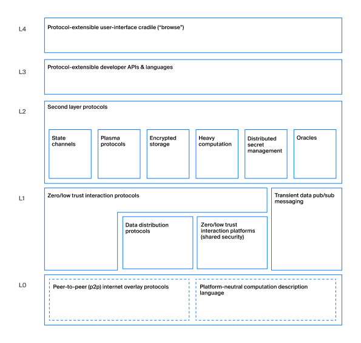

# Chapter 1. A Brief History of the Web, or Web 1.0 to Web 3.0

You are holding a book on Web3 in your hands, but perhaps you first want to know what Web3 is, how it differs from Web2, and what does Waves have to do with it. In this chapter, we will look at all of these issues.
You've probably heard that the Internet, as a signal transmission technology, appeared more than 50 years ago, or to be more precise, on September 2, 1969. It was on this day that 2 computers transmitted data to each other for the first time. But the world wide web, as we currently understand it, was invented by Sir Tim Berners Lee 20 years later, in 1989. In fact, he invented the Internet as we know it today, made up of millions of hypertext markup documents linked together by links. The Internet in 1989 was completely different, lacking social networks like Facebook, online shops like Amazon, or even search engines and memes sites.

The Internet was read-only back then. Sites were only at research centers, large universities and companies, and it was they who created all the content and distributed it in the form of static web pages, the only form of interaction with which was clicking on a link to another page. It was the wonderful world of Web 1.0.

**In other words, Web 1.0 is a read-only Internet for most of its users.**

As time went on and the speed of spread of technology only increased, in the 90s the Internet experienced a boom and the "crash of dot-coms", but it was this crash that gave the opportunity to the next evolution of web pages on the Internet. These web pages were different in that they offered users the tools to interact with each other. One of the first such forms of interaction were forums, which have now almost disappeared into oblivion, but were once very popular. In addition to forums, other platforms began to appear with content from users, not just site owners (user generated content). The Internet became not only for reading, but also for creation and creation, pages became interactive, technologies allowed users to interact without page reloads (AJAX appeared). We still live in the Web 2.0 world.

**Web 2.0 - Internet with content from users and the ability to interact with other users**

But what exactly is Web 3.0? How to define it? You may be old enough to remember the idea of ​​the "semantic web". Semantic Web - a family of standards that aimed at creating protocols for exchanging data on the Web. A couple of years ago, this was what was meant by Web 3.0, but now the vision of the future has changed.

The world wide web is becoming more complex, connected, and even smart. The number of users, the number and quality of their interactions are growing. The number of challenges and problems facing the World Wide Web is also growing, especially in connection with hacks, data leaks, manipulations, sales of personal information, etc. This is largely due to the history of the web, because from the very beginning there were practically no monetization models on the Internet other than advertising, which leads to user tracking. And the most natural form of development of Internet platforms has become monopolies, because the Internet has no borders, physical restrictions, so it is much easier to capture markets. One of the answers to these problems is **decentralization**. The web of the future must be focused on security, privacy, and focus on the user, not the corporation. For this, Web 3.0 can use technologies such as Blockchain, but, obviously, there will be a lot of Artificial Intelligence, Big Data, VR / AR on the web of the future.

The transition to Web 3.0 is different from the transition from Web1.0 to Web2.0. Web 3.0 isn't about speed, performance or convenience, it's about **power**. Users have power over their data, not corporations have power over users.

One of the pioneers of Web 3.0 and co-founder of the Ethereum blockchain platform Gavin Wood back in 2014 in his [blog post] (http://gavwood.com/dappsweb3.html) described Web 3.0 with the following words:

> “Rethinking things for which we already use the Web, but with a fundamentally different model of interaction between the parties. We publish information that we consider to be publicly available. We put the information that we want to negotiate in a distributed ledger. We keep information that is private and never disclose it. Communication always takes place over encrypted channels and only with aliases as endpoints; but never with tracked aliases (like IP addresses). In short, we are designing a system that **mathematically** enforces our assumptions about the availability of information, because no government or organization can be trusted. "

The mathematical compulsion to comply with our assumptions is the use of cryptography, and blockchain allows us to get rid of trust. In this book, we will practically not touch on the issues of cryptography, since we are more interested in the practical applicability of the ideas of Web3 and how we can start making web applications of the future today.

## What is Web 3.0 made of

Web3 is now in its infancy, both in terms of the number of applications and the number of users of those applications. And that is why now is the time to start making applications that will help attract more users. At the same time, no one rules out the scenario that our current understanding of Web 3.0 will change in the future and the principles described in this book will become as irrelevant as the "semantic web" is not.

Let's take a look at what Web 3.0 currently consists of. The description of the layers of Web 3.0 technologies, which can be found on the [Web3 Foundation] website (https://web3.foundation/about/), will help us with this. At the moment, the Web3 stack describes everything related to the blockchain, without affecting other possible technologies. The stack consists of 5 layers, from level 0 to level 4.

Layer 0 is the backbone of the Web3 technology stack, which consists of how hosts interact and how they can be programmed at the lowest level. As part of this book, we will look at the Waves Blockchain and its node communication protocol. In many cases, level 0 is a black box for application developers that does not affect the user experience or development process in any way.

The next level is Level 1, which disseminates and interacts with data. The layer can also be referred to as the "zero trust interworking protocol". Basically, it is a protocol that describes how different nodes on the blockchain network interact with each other, it allows them to exchange and verify each other. This layer mainly deals with data distribution protocols and temporary / intermediate messages. Level 1 is required for the blockchain itself to function properly. This level can affect the user experience, for example, in terms of delays in getting information into the blockchain, so it is important to understand how the system works at this level.

When developing Web3 applications, you will definitely work with Layer 2 protocols. It is a series of protocols that include many interesting technical solutions such as State Channels, Plasma Protocols, oracles, and so on. This layer extends the capabilities of Layer 1 to provide scalability, encrypted messaging, and distributed computing. In this book we will describe working with oracles. Oracles are a way to get data from the real world within the blockchain system (for example, weather or stock prices). Web3 applications are very often tied to data that is outside the blockchain, so working with such data and oracles is extremely important. Chapter 7 will take a closer look at the oracle problem.

Level 3 focuses on programming languages ​​and libraries that allow developers to create programs at the proper level of abstraction, without unnecessary low-level details. This layer is also known as "extensible protocols, APIs, and developer languages". There are many languages ​​that can be used to develop applications without using real bytecode, such as Solidity for Ethereum, Plutus for Cardano, and Ride for Waves. In addition, there are many platforms and libraries that facilitate the development of blockchain interoperable applications. We will be using Ride and the Waves Blockchain JavaScript library. There are many libraries for different languages, for PHP, Java, Python, Kotlin, Swift and many others, but we will only cover the JavaScript / Typescript library.

Finally, we move on to the top level of the stack, level 4, which is the UI level. It contains technologies that allow the average user, non-developer, to interact with Web3 applications. Some common browsers (like Opera) allow users to interact directly with blockchains, but some of the most popular browsers: Chrome, Firefox and Microsoft Edge require additional tools from users, the most common tool being browser extensions. In Chapter 8 we'll look at an example of such a browser extension and see how to work with it.

The general layout of the Web3 stack looks like this:

## Waves technology stack

In this book, we will look at all layers of the Web3 stack using the Waves protocol as an example.

We will start our examination with the most basic layers, then we will talk about the Ride programming language, development tools, oracles and ways of interacting with the user. In the course of considering technologies, we will also talk about philosophy and the reasons for certain technical solutions.