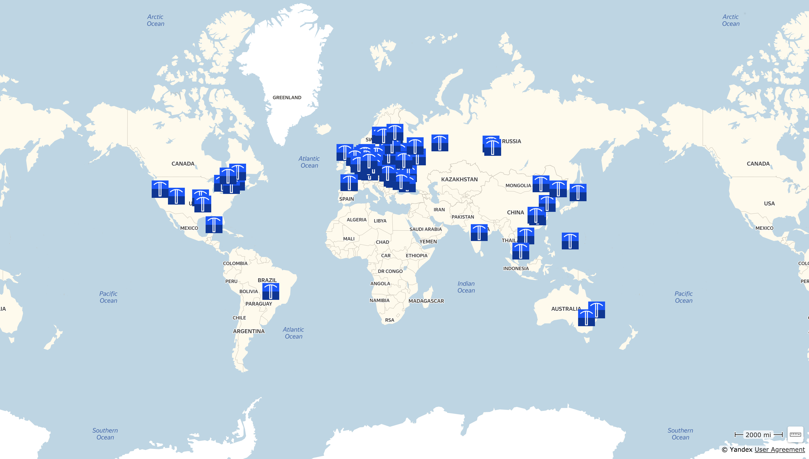

# 1.3 Distinctive features of the Waves blockchain

If you already have experience with other blockchains, you may be wondering how Waves differs from conditional Ethereum and why it is different. Let's quickly go over the differences, which will be explored in detail in the following sections.

## Working with tokens / assets

One of the features of working with Waves from day one was the ease of issuing tokens. To do this, just send a transaction or [fill out a 5-field form](https://docs.waves.exchange/en/waves-exchange/waves-exchange-online-desktop/online-desktop-asset/online-desktop-token-creation) in any UI client.
The issued token automatically becomes available for transfers, trading on a decentralized exchange, dApp use and burning.

Unlike Ethereum, Waves tokens are not smart contracts, but are "first-class citizens", that is, they are a separate full-fledged entity. This has both advantages and disadvantages, which we'll talk about in Section 4 Tokens.

## Transactions

Another distinctive feature of Waves is the large number of transaction types. For example, Ethereum has smart contracts that can be anything, depending on their implementation. The ERC-20 describing the token is just a description of the smart contract interface - what methods it should have. Waves assumes that it is better to have lightweight/narrow specific things than abstract "about everything and nothing". The specificity of the primitives makes development easier in many places, but this is sometimes a less flexible solution.

Below is a list of current transactions at the time of this writing:

In Chapter 5, "Transactions," we'll go over each of them in detail.

## Leasing

Waves has a staking mechanism called leasing. Any Waves token holder can lease tokens to any Waves node to produce blocks "on behalf of those tokens."

> The lessor transfers the right to generate blocks on behalf of its tokens to the lessee (the owner of the node).

This is usually done when the user does not want or cannot deal with the deployment of his node and its support. Typically, the owners pay lizngovyh pools used about most of the earned through leasing by the lessor. You can lease funds instantly, but they will start to be taken into account in the generating balance of the node only after 1000 blocks.

You can pick up tokens from leasing instantly.

## Fair PoS

Waves uses the Proof-of-Stake algorithm to determine the right to generate a block. Blocks are generated on average every minute, and the probability of a block being generated by a node depends on 3 parameters:

- The generating balance of the node, that is, the balance of the node itself + the number of tokens that have been leased to it.
- Current time and randomness (great random is always in life!)
- Generating network balance, because not all tokens in the network participate in block generation, they can be in orders on exchanges or lie in cold wallets.

To start generating blocks, it is enough to have 1000 Waves generating balance (own + leased). Why do you need to generate blocks? For each block, the node receives commissions from transactions in this block and a reward "out of thin air" on its balance sheet. Both of these points are not so simple, so we will look at them a little later.

A very common question that comes up - how many blocks will I generate per month with balance N? It is impossible to predict the exact number, as it depends on chances and changes in the network, but it is possible to predict approximately. To do this, you need to know the current network parameters:

1. *How many Waves tokens are involved in block generation?* This is the so-called generating balance of the network as a whole. For ease of calculation, let's say that 50 million tokens are involved in block generation.
2. *What is the balance of our node?* That is, how many tokens we have on the node's account and how many we have been leased. In our case, let's take the generating balance equal to 10,000 Waves.
3. The average block time is 1 minute, that is, the network generates approximately 1440 blocks per day or 43,200 blocks per month.

To calculate the approximate number of blocks that we will generate, divide the number of blocks for the period by the generating network balance and multiply by our balance:

$ ForgedBlocks = BlocksCountInPeriod / NetworkGenBalance * NodeGenBalance $

Having done some simple calculations, we get:

`43200/50000000 * 10000 = 8.64`

That is, on average, a node will generate 8-9 blocks per month if it works stably and the network parameters do not change, but, of course, this does not happen, because a large number of transactions are constantly being made on the network, which change generating balances of the entire network in as a whole and each node separately.

## Community driven monetary policy

At first, Waves had a limited emission of 100 million tokens, which were issued immediately at the time the mainnet was launched, but since the fall of 2019, the community decided that for the further growth of the ecosystem, it would be better to include the emission of tokens in the protocol. That is, new Waves tokens appear in each new block. The exact number of tokens is determined by the community, which votes for the size of the reward every 100 thousand blocks. At the time of this writing, the block reward was 6 Waves. At the same time, it is guaranteed that the size of the reward cannot change by more than 0.5 Waves after each voting period.

## Sponsorship

The token sponsorship feature is a way to reduce barriers to entry for users. The bottom line is that the account that issued the token can sponsor transactions with that token. Let's say there is token A, it was issued by Cooper and sponsored. For example, Alice has earned 100 A tokens and wants to send 10 of them to Bob. We know that for each transaction in the blockchain, you need to pay a commission, in the Waves network, miners accept only Waves in the form of a commission, and Alice does not have Waves. Have to go and buy Waves somehow?

No. Sponsoring a token allows its owner to say that he is ready to take on commissions for operations with this token (token A in our case). The owners of token A will pay the same token as a commission when sending a transaction. In our example, Alice will be able to indicate in her transaction that the recipient is Bob, the amount to be sent is 10 tokens A, the commission is 5 tokens A. As a result, 15 tokens will be debited from her account, 10 will receive Bob, 5 will receive Cooper as the issuer and the sponsoring token, and the miner will receive Waves from Cooper's account.

Why will Alice pay 5 tokens and how much will the miner receive? We'll talk about this in the next chapters. The main thing to remember now is **there are ways to send a transaction in Waves without having Waves tokens on your balance sheet.**

## Ride and smart contracts

Waves is a general purpose blockchain that does not specialize in one thing, so the emergence of smart contracts was a logical continuation of the platform's development. We'll talk about smart contracts in Waves in Chapter 6 "Ride". Now it is worth noting that contracts are written in the Ride language, which was invented specifically for smart contracts and is not Turing complete. There are no cycles in the language, but there is no gas, there are no "Out of gas" errors like in Ethereum, and the cost of a transaction is always known in advance. Intrigued? This is just the beginning, we will talk about the Ride execution model and language syntax later.

## Waves NG

Earlier, I already [touched on the topic](./1-1-history-of-waves.md) related to Waves NG and mentioned that it allows transactions to get into blocks faster and work on the blockchain so quickly that the platform is able to process hundreds of transactions per second on the mainnet. And there, for a minute, there are more than 400 nodes distributed around the world, on completely different hardware and with different bandwidth.

## DEX

The easy and fast token issuance along with "class equality" (remember that tokens are first class citizens?) Make token trading easy. The Waves node (talking about the Scala version) supports the ability to create extensions, one of such extensions is the matcher. The matcher accepts orders to buy and sell tokens and stores them (centrally). For example, Alice wants to sell wBTC token and buy Waves, while Bob wants to do the opposite. They form orders (cryptographically signed primitives) and send them to the matcher, which determines that these orders are placed in one pair and that they can be matched at a certain price. As a result, the matcher forms an Exchange transaction that contains 2 orders (one from Alice, the other from Bob) and sends it to the blockchain. At the same time, the matcher takes a commission from users, and the node that will mine the block from the Exchange of transactions receives a commission from the matcher.

