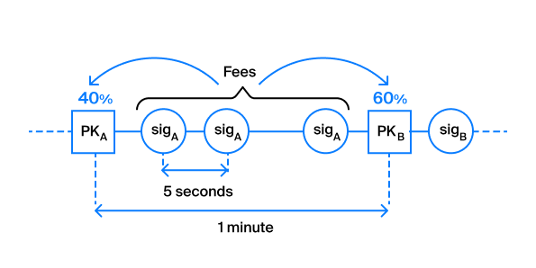

# The mining process and Waves NG

The mining process is key for a node, after all, its main task is to produce blocks with transactions. To do this effectively, a node must also receive information about blocks from other nodes and send them its blocks. Let's take a look at a simplified Waves mining model. For more information on the mining process, including formulas, see the article [Fair Proof of Stake](https://forum.wavesplatform.com/uploads/default/original/1X/b9f220c13f73c3a41dff7f4523c6c4a1fc03ebf6.pdf).

## Proof of Stake

Mining is based on the Proof-of-Stake algorithm, which implies that the probability of generating a block by any account is directly proportional to the balance of this account. Let's consider the simplest case: let's say we have an account with a balance of 10 million Waves (out of 100 million issued at the time of creation). The probability of mining a block will be 10%, in other words, we will generate approximately 144 blocks per day (1440 total blocks per day appear on the network on average).

Now let's complicate things a little. Although only 100 million tokens were issued, not all of them participate in mining (for example, tokens can be on the exchange, and not on the node's account). If 50 million are involved in mining, then a node with a balance of 10 million will already generate 288 blocks per day. But in fact, the number of tokens that participate in mining is constantly changing, so it is impossible to directly predict how many blocks will be mined.

The question that arose from the most curious - *in what order will the nodes generate blocks?*. To answer this question, you will need to delve into the specifics of the PoS implementation in Waves, so buckle up and cheer up.

We can say that to answer the question "Who will be the next generator of the block?" nodes use information about balances, time between blocks and a pseudo-random number generator. Let's start with the latter, using `urandom` in this case will not work, since it is non-deterministic, and each node will receive its own result. Therefore, the nodes "agree" about the randomness. Each block in the chain contains, along with transactions, the address of the node that generated the block, version and time, a field called `generation-signature`. Take a look at what block number 1908853 looks like in the mainnet in JSON representation (without transactions):

```json
{
  "blocksize": 22520,
  "reward": 600000000,
  "signature": "2kCWg8HMhLPXGDi94Y6dm9NRx4aXjXpVmYAE4y4KaPzgt1Z5EX9mevfWoiBLLr1cc1TZhTSqpozUJJZ3BpA5j3oc",
  "generator": "3PEFQiFMLm1gTVjPdfCErG8mTHRcH2ATaWa",
  "version": 4,
  "reference": "3Jcr6m6SM3hZ1bu6xXBmAVhA2VEUHMvE6omhEiRFn3VhEuDkgb6sgeJUC1VNRB3vTSwPb5qh576a8DwGt3Ts72Tx",
  "features": [],
  "totalFee": 28800000,
  "nxt-consensus": {
    "base-target": 74,
    "generation-signature": "6cVJBZsjzuSqp7LPD3ZSw5V1BZ25hZQHioh9gHjWPKNq"
  },
  "desiredReward": 600000000,
  "transactionCount": 70,
  "timestamp": 1580458301503,
  "height": 1908853
}
```

Note that for convenience, the data structures in this book are presented in JSON format, but the nodes themselves work with blocks, transactions, signatures, etc. in binary format. For this, there are descriptions of binary data structures in the documentation, and more recently the binary data format is Protobuf.

Generation signature is the SHA256 hash of the `generation-signature` of the previous block and the public key of the generator of this block. The first 8 bytes of the `generting-signature` hash are converted to a number and used as a kind of random, called` hit`. The base-target value is responsible for the average time between blocks and is recalculated during the generation of each block. If the network constantly had all the nodes with the entire network stake, ready to generate a block, then `base-target` would not be needed, but if this is not the case, a synthetic parameter is needed, which changes depending on the current time between blocks and automatically align the average time between blocks is 60 seconds.

So, we have the parameters `hit`, which is a pseudo-random number, the balance of each account and the value of` base-target`, but what should the node do with all this? Each node, at the moment of receiving a new block over the network, starts the check function when it is its turn to generate a block.

>    Δt = f(hit, balance, baseTarget)

 As a result of executing this function, the node gets the number of seconds until the moment when it is time to generate the block. In fact, after this, the node sets a timer, upon the occurrence of which it will start generating a block. If it receives the next block before the timer occurs, then the operation will be performed again and the timer will be reset to the new value `Δt`.

 Blocks are validated in the same way, with one exception that the balance is not substituted into the formula of this node, but of the one that generated the block.

## Waves NG

If you know anything about Waves at all, you may have heard of Waves NG, which makes the Waves blockchain fast and responsive. Waves-NG gets its name from the article [Bitcoin-NG: A Scalable Blockchain Protocol](https://www.usenix.org/system/files/conference/nsdi16/nsdi16-paper-eyal.pdf), which was published in 2016 and offered a way to scale the Bitcoin network by changing the block generation protocol. NG in the name stands for Next Generation, and indeed the proposal would have helped the Bitcoin network reach a new level of bandwidth, but this initiative was never implemented in Bitcoin. But it was embodied in the Waves protocol at the end of 2017. Waves NG affects how blocks are generated and how nodes communicate with each other.

At the moment of its mining time, the node generates the so-called * key block *, becoming the leader. The key block does not contain transactions, it is only the beginning of the block that will change. Then the leader gets the right to generate the so-called * microblocks *, which add new transactions to the end of the block and change its signature. For example, the leader generates a key block with the following parameters:

```json
{
  "blocksize": 39804,
  "reward": 600000000,
  "signature": "4oBqMB7szmsbSYYguiaAXSE7ZLy13e4x97EKMmA4gs6puRqPKzCVJkuC6Py9eTpiovhcLAYuUSsnEYAi4i73tvoA",
  "generator": "3P2HNUd5VUPLMQkJmctTPEeeHumiPN2GkTb",
  "version": 4,
  "reference": "4KEFeMDQgPdntzqmSNZ92NBSMcNft1o4EyQexNLXEdN3976XbdYwDgqaucd9gu2PJWt9tpt1wuvRcTMiiDtkZaX7",
  "features": [],
  "totalFee": 0,
  "nxt-consensus": {
    "base-target": 66,
    "generation-signature": "HpFc5qqVftyjKbqhADkQGWBg38CVR9Bz29c7uDZKKvYV"
  },
  "desiredReward": 600000000,
  "transactionCount": 0,
  "timestamp": 1580472824775,
  "height": 1909100
}
```

There are no transactions in the block, as can be seen from the `transactionCount` value, but the basic parameters such as the signature and the link to the previous block (the` reference` field) are already there. The creator of this block will be able in a few seconds to generate a microblock with all the transactions that appeared on the network during those seconds, and send it to the rest of the nodes. In this case, some fields in the block will change:

```json
{
  // unchanged parameters were omitted
  "blocksize": 51385,
  "signature": "4xMaGjQxMX2Zd4jMUUUs5cmemkVwT8Jc5sqx6wzMUokVqWg5jvWSDF6SBF1P7x4UNQjYsgsCs4csa2qtRmG8j3g4",
  "totalFee": 65400000,
  "transactionCount": 167,
  "tranasctions": [{...}, {...}, ..., {...}]
}
```

167 transactions were added to the block, which increased the block size, the block signature and the commission that the leader will earn has also changed.

A few important points to understand:

- Microblock contains only transactions and the leader's signature, consensus parameters are not duplicated
- The generation time of microblocks depends on the miner's settings (the `waves.miner.micro-block-interval` field in the configuration sets a value for each node). By default, the leader will generate microblocks every 5 seconds.
- With each new microblock, the data of the last block changes, so the last block is called a "liquid" block
- The key block and all the microblocks that belong to it are combined into one block so that no microblock data remains in the blockchain. We can say that they are used only to transfer information about transactions between nodes.

The block leader will generate microblocks and change the liquid block until another key block in the network is generated (that is, the mining start timer is triggered for some other node) or the block size limits (1 MB) are reached.

## What does Waves NG do?

**Thanks to Waves NG, the time it takes for a transaction to enter a block is reduced. That is, you can provide a much better user experience in your application.** The user can receive feedback on his transaction in ~ 5 seconds, if there is no long queue for hitting the block. You just need to understand that hitting a block is not a guarantee of finalization and the block can be canceled (up to 100 blocks deep, but in practice 2-3 blocks in extremely rare cases).

**Waves NG makes the load on the network more even.** In the absence of Waves NG, blocks would be generated once a minute (1 MB of data at once) and sent over the network as a whole. That is, you can imagine situations when for 50 seconds the nodes (except for the miner) do nothing and wait, and then accept the block and validate it for 10 seconds. With Waves NG, this load is more spread out over time, the nodes receive a new portion of data every 5 seconds and validate it. This generally improves throughput.

Waves NG, however, can sometimes behave not very conveniently. As you remember, each block contains a reference field, which is a reference to the signature field of the previous block. `reference` is fixed at the moment of generation of the key block, and it may happen that the new miner puts in his key block a link not to the last state of the liquid block. In other words, if the new miner of block `N` did not manage to get and apply the last microblock of block` N - 1` from the previous miner, then it will refer to the "old" version of block `N - 1`, transactions from the last microblock will be deleted from the block `N - 1` for the whole network.

But do not be alarmed, this will only lead to the **that the excluded transactions will fall into the `N`** block, instead of the` N - 1` block, in which we could already have time to see these transactions in our client code.

Waves NG also affects the distribution of commissions in the block. The miner receives 60% of the commissions from the previous block and 40% from his block. This was done in order to exclude a possible "dirty game" of nodes, when they specifically refer to the very first version of the previous block in order to take all transactions from there and put them in their own block, and therefore receive commissions.



The resulting commission can be spent by the miner in the same block. He can add a transaction to the block, for which he will receive a commission of 0.1 Waves and, in the next transaction, put it in a block that transfers these 0.1 Waves from his account.