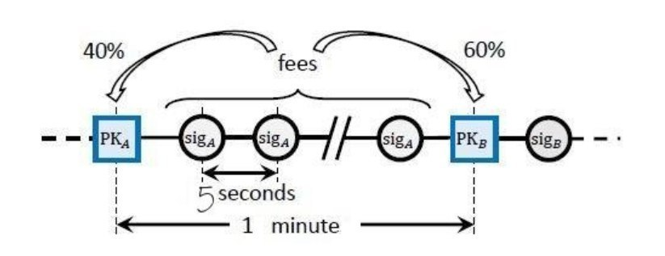

# Процесс майнинга и Waves NG

Процесс майнинга является ключевым для ноды, в конце концов ее основная задача в том, чтобы производить блоки с транзакциями. Чтобы это эффективно делать, нода также должна получать информацию о блоках от других нод и отправлять им свои блоки. Давайте рассмотрим упрощенную модель майнинга в Waves. Более подробная информация о процессе майнинга, включая формулы, есть в статье [Fair Proof of Stake](https://forum.wavesplatform.com/uploads/default/original/1X/b9f220c13f73c3a41dff7f4523c6c4a1fc03ebf6.pdf).

## Proof of Stake

В основе майнинга лежит алгоритм Proof-of-Stake, который подразумевает, что вероятность сгенерировать блок каким-либо аккаунтом прямо пропорциональна балансу этого аккаунта. Давайте рассмотрим простейший случай: допустим, у нас есть аккаунт с балансом 10 млн Waves (из 100 млн выпущенных в момент создания). Вероятность смайнить блок будет 10%, иными словами мы будем генерировать примерно 144 блока в сутки (1440 всего блоков за сутки в среднем появляется в сети).

Теперь немного усложним. Хоть и выпущено всего 100 миллионов токенов, не все из них участвуют в майнинге (например, токены могут быть на бирже, а не на аккаунте ноды). Если в майнинге участвует 50 миллионов, то нода с балансом в 10 млн уже будет генерировать 288 блоков в сутки. Но на самом деле количество токенов, которые участвуют в майнинге, постоянно меняется, поэтому прямо предсказать, сколько будет смайнено блоков, не получится.

Вопрос, который возник у самых любопытных - *в каком порядке ноды будут генерировать блоки?*. Для ответа на этот вопрос потребуется углубиться в особенности реализации PoS в Waves, поэтому пристегнитесь и взбодритесь.

Можно сказать, что для ответа на вопрос "Кто будет следующим генератороом блока?" ноды используют информацию о балансах, времени между блоками и генератор псевдо-случайных чисел. Начнем с последнего, использовать `urandom` в данном случае не получится, так как он недетерминированный, и каждая нода получит свой результат. Поэтому ноды "договариваются" о рандоме. Каждый блок в цепочке содержит наряду с транзакциями, адресом ноды, сгенерировавшей блок, версией и времеменем, поле, называемое `generation-signature`. Взгляните, как выглядит блок номер 1908853 в мейннете в JSON представлении (без транзакций):

```json
{
  "blocksize": 22520,
  "reward": 600000000,
  "signature": "2kCWg8HMhLPXGDi94Y6dm9NRx4aXjXpVmYAE4y4KaPzgt1Z5EX9mevfWoiBLLr1cc1TZhTSqpozUJJZ3BpA5j3oc",
  "generator": "3PEFQiFMLm1gTVjPdfCErG8mTHRcH2ATaWa",
  "version": 4,
  "reference": "3Jcr6m6SM3hZ1bu6xXBmAVhA2VEUHMvE6omhEiRFn3VhEuDkgb6sgeJUC1VNRB3vTSwPb5qh576a8DwGt3Ts72Tx",
  "features": [],
  "totalFee": 28800000,
  "nxt-consensus": {
    "base-target": 74,
    "generation-signature": "6cVJBZsjzuSqp7LPD3ZSw5V1BZ25hZQHioh9gHjWPKNq"
  },
  "desiredReward": 600000000,
  "transactionCount": 70,
  "timestamp": 1580458301503,
  "height": 1908853
}
```

Обратите внимание: для удобства структуры данных в этой книге представлены в формате JSON, но сами ноды работают с блоками, транзакциями, подписями и т.д. в бинарном формате. Для этого есть описания бинарных структур данных в документации, а с недавнего времени бинарный формат данных представляет из себя Protobuf.

Generation signature является SHA256 хэшом от `generation-signature` предыдущего блока и публичного ключа генератора этого блока. Первые 8 байт хэша `generting-signature` конвертируются в число и используется как некий рандом, называемый `hit`. Значение `base-target` отвечает за среднее время между блоками и пересчитывается во время генерации каждого блока. Если бы в сети постоянно были все ноды со всем стейком сети, готовые сгенерировать блок, то `base-target` не был бы нужен, но коль это не так, нужен синтетический параметр, который меняется в зависимости от текущего времени между блоками и автоматически выравнивать среднее время между блоками в 60 секунд.

Итак, у нас есть параметры `hit`, который является псевдо-случайным числом, баланс каждого аккаунта и значение `base-target`, но что делать ноде со всем этим? Каждая нода, в момент получения нового блока по сети, запускает функцию проверки, когда будет ее очередь генерировать блок.

>    Δt = f(hit, balance, baseTarget)

 В результате выполнения этой функции, нода получает число секунд до момента, когда наступит ее время генерировать блок. Фактически, после этого нода устанавливает таймер, при наступлении которого начнет генерировать блок. Если она получит следующий блок до наступления таймера, то операция будет выполнена заново и таймер будет переставлен на новое значение `Δt`.

 Валидация блоков происходит таким же образом, за одним исключением, что в формулу подставляется баланс не этой ноды, а сгенерировавшей блок.

## Waves NG

Если вы вообще что-то знаете про Waves, то могли слышать про Waves NG, который делает блокчейн Waves быстрым и отзывчивым. Waves-NG получил свое названия от статьи [Bitcoin-NG: A Scalable Blockchain Protocol](https://www.usenix.org/system/files/conference/nsdi16/nsdi16-paper-eyal.pdf), которая была опубликована в 2016 году и предлагала способ масштабирования сети Bitcoin за счет изменения протокола генерации блоков. NG в названии расшифровывается как Next Generation, и действительно предложение помогло бы сети Bitcoin выйти на новый уровень по пропускной способности, но эта инициатива так никогда и не была реализована в Bitcoin. Зато была воплощена в протоколе Waves в конце 2017 года. Waves NG влияет на то, как генерируются блоки и ноды общаются друг с другом.

В момент наступления своего времени майнинга, нода генерирует так называемый *ключевой блок* (key block), становясь лидером. Ключевой блок не содержит транзакций, он является только началом блока, который будет меняться. Далее лидер получает право генерировать так называемые *микроблоки*, которые добавляют новые транзакции в конец блока и меняют его сигнатуру. Например, лидер генерирует ключевой блок со следующими параметрами:

```json
{
  "blocksize": 39804,
  "reward": 600000000,
  "signature": "4oBqMB7szmsbSYYguiaAXSE7ZLy13e4x97EKMmA4gs6puRqPKzCVJkuC6Py9eTpiovhcLAYuUSsnEYAi4i73tvoA",
  "generator": "3P2HNUd5VUPLMQkJmctTPEeeHumiPN2GkTb",
  "version": 4,
  "reference": "4KEFeMDQgPdntzqmSNZ92NBSMcNft1o4EyQexNLXEdN3976XbdYwDgqaucd9gu2PJWt9tpt1wuvRcTMiiDtkZaX7",
  "features": [],
  "totalFee": 0,
  "nxt-consensus": {
    "base-target": 66,
    "generation-signature": "HpFc5qqVftyjKbqhADkQGWBg38CVR9Bz29c7uDZKKvYV"
  },
  "desiredReward": 600000000,
  "transactionCount": 0,
  "timestamp": 1580472824775,
  "height": 1909100
}
```

В блоке нет транзакций, что видно из значения `transactionCount`, но основные параметры вроде подписи и ссылки на предыдущий блок (поле `reference`) уже есть. Создатель этого блока сможет через несколько секунд сгенерировать микроблок со всеми транзакциями, которые появились в сети за эти секунды, и разослать остальным нодам. При этом в блоке поменяются некоторые поля:

```json
{
  // неизмененные параметры опущены
  "blocksize": 51385,
  "signature": "4xMaGjQxMX2Zd4jMUUUs5cmemkVwT8Jc5sqx6wzMUokVqWg5jvWSDF6SBF1P7x4UNQjYsgsCs4csa2qtRmG8j3g4",
  "totalFee": 65400000,
  "transactionCount": 167,
  "tranasctions": [{...}, {...}, ..., {...}]
}
```

В блок добавились 167 транзакций, которые увеличили размер блока, так же поменялась подпись блока и комиссия, которую заработает лидер.

Несколько важных моментов, которые важно понимать:

- Микроблок содержит только транзакции и подпись лидера, параметры консенсуса не дублируются
- Время генерации микроблоков зависит от настроек майнера (поле `waves.miner.micro-block-interval` в конфигурации задает значение для каждой ноды). По умолчанию лидер будет генерировать микроблоки каждые 5 секунд.
- При каждом новом микроблоке меняются данные последнего блока, поэтому последний блок называют "жидким" (liquid) блоком
- Ключевой блок и все микроблоки, которые к нему относятся, объединяются в один блок так, что в блокчейне не остается никаких данных о микроблоках. Можно сказать, что они используются только для передачи информации о транзакциях между нодами.

Лидер блока будет генерировать микроблоки и менять жидкий блок до тех пор, пока не будет сгенерирован другой ключевой блок в сети (то есть у какой-то другой ноды сработает таймер начала майнинга) или достигнуты лимиты блока на размер (1 МБ).

## Что дает Waves NG?

**Благодаря Waves NG сокращается время попадания транзакции в блок. То есть можно в своем приложении обеспечивать гораздо лучший пользовательский опыт.** Пользователь может получать обратную связь по своей транзакции за ~5 секунд, если нет большой очереди за попадание в блок. Только надо понимать, что попадание в блок не является гарантией финализации и блок может быть отменен (до 100 блоков в глубину, но на практике 2-3 блока в крайне редких случаях).

**Waves NG делает нагрузку на сеть более равномерной.** В случае отсутствия Waves NG, блоки генерировались бы раз в минуту (сразу 1 МБ данных) и отправлялись бы по сети целиком. То есть можно представить ситуации, когда 50 секунд ноды (кроме майнера) ничего не делают и ждут, а потом принимают блок и валидируют его на протяжении 10 секунд. С Waves NG эта нагрузка более размазана по времени, ноды получают каждые 5 секунд новую порцию данных и валидируют их. Это в целом повышает пропускную способность.

Waves NG однако может себя иногда вести не очень удобно. Как вы помните, каждый блок содержит в себе поле `reference`, которое является ссылкой на поле `signature` предыдущего блока. `reference` фиксируется в момент генерации ключевого блока, и может случиться такое, что новый майнер поставит в своем ключевом блоке ссылку не на последнее состояние жидкого блока. Иными словами, если новый майнер блока `N` не успел получить и применить последний микроблок блока `N - 1` от предыдущего майнера, то он сошлется на "старую" версию блока `N - 1`, транзакции из последнего микроблока будут удалены из блока `N - 1` для всей сети.

Но не пугайтесь, это приведет только к тому, **что исключенные транзакции попадут в блок `N`**, вместо блока `N - 1`, в котором мы уже могли успеть увидеть эти транзакции в своем клиентском коде.

Waves NG так же влияет на распределение комиссий в блоке. Майнер получает 60% от комиссий из предыдущего блока и 40% из своего блока. Сделано это для того, чтобы исключить возможную "грязную игру" узлов, когда они будут специально ссылаться на самую первую версию предыдущего блока, чтобы забрать все транзакции оттуда и положить в свой блок, а соответственно получить и комиссии.



Получаемая комиссия может быть потрачена майнером в этом же блоке. Он может добавить в блок транзакцию, за которую получит комиссию в 0.1 Waves и следующей же транзакцией положить в блок, переводящую эти 0.1 Waves с его аккаунта.
