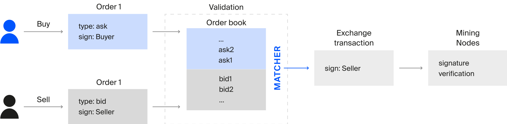

# Торговля ассетами и DEX

После появления возможности создания своих токенов, было логичным сделать возможность торговли ими (а если быть точнее - обмена) без участия посредников. Для этого в Waves был создан матчер (от англ "match" - соответствовать, подходить под пару), долгое время являвшийся частью ноды, по умолчанию выключенной (достаточно было в конфигурации ноды включить флаг `waves.matcher.enabled`).

## Как работает матчер

Матчер принимает от пользователей заявки на обмен токенов, в экосистеме Waves такие заявки принято называть order. Пример такой "заявки" или "намерения" пользователя совершить обмен, представлен ниже:

```json
{
  "version": 3,
  "senderPublicKey": "FMc1iASTGwTC1tDwiKtrVHtdMkrVJ1S3rEBQifEdHnT2",
  "matcherPublicKey": "7kPFrHDiGw1rCm7LPszuECwWYL3dMf6iMifLRDJQZMzy",
  "assetPair": {
    "amountAsset": "BrjUWjndUanm5VsJkbUip8VRYy6LWJePtxya3FNv4TQa",
    "priceAsset": null
  },
  "orderType": "buy",
  "amount": 150000000,
  "timestamp": 1548660872383,
  "expiration": 1551252872383,
  "matcherFee": 300000,
  "proofs": [
    "YNPdPqEUGRW42bFyGqJ8VLHHBYnpukna3NSin26ERZargGEboAhjygenY67gKNgvP5nm5ZV8VGZW3bNtejSKGEa"
  ],
  "id": "Ho6Y16AKDrySs5VTa983kjg3yCx32iDzDHpDJ5iabXka",
  "sender": "3PEFvFmyyZC1n4sfNWq6iwAVhzUT87RTFcA",
  "price": 1799925005,
}
```

Помимо информации об отправителе, служебных полей и подписи, каждый order содержит в себе информацию о том, в какой паре токенов должен произойти обмен, тип ордера (`buy` или `sell`), срок истечения действия ордера, количество токенов для обмена и цену, по которой пользователь хочет совершить обмен. Посмотрев на пример выше, можно понять, что пользователь хочет обменять `Waves`, потому что `assetPair.priceAsset` равен `null` и тип ордера `buyd`, на токен c assetId `BrjUWjndUanm5VsJkbUip8VRYy6LWJePtxya3FNv4TQa` и [названием `Zcash`](https://wavesexplorer.com/tx/BrjUWjndUanm5VsJkbUip8VRYy6LWJePtxya3FNv4TQa), которое можно найти в эксплорере.

Количество токенов для обмена указано 150000000 (всегда помним, что у Waves 8 знаков после запятой, поэтому фактически он хочет обменять 1.5 Waves) на Zcash по цене 17.99925005 за единицу (у Zcash количество знаков после запятой тоже 8). Иными словами, если найдется желающий продать 1 Zchah токен в обмен на 17.99925005 не позднее указанной даты экспирации (1551252872383 или 02/27/2019 @ 7:34am UTC), то будет совершен обмен.

Давайте представим, что другой пользователь отправил контр-ордер для этой же пары со следующими параметрами:

```json 
{
  "version": 3,
  "senderPublicKey": "FMc1iASTGwTC1tDwiKtrVHtdMkrVJ1S3rEBQifEdHnT2",
  "matcherPublicKey": "7kPFrHDiGw1rCm7LPszuECwWYL3dMf6iMifLRDJQZMzy",
  "assetPair": {
    "amountAsset": "BrjUWjndUanm5VsJkbUip8VRYy6LWJePtxya3FNv4TQa",
    "priceAsset": null
  },
  "orderType": "sell",
  "amount": 3000000000,
  "timestamp": 154866085334,
  "expiration": 1551252885334,
  "matcherFee": 300000,
  "proofs": [
    "YNPdPqEUGRW42bFyGqJ8VLHHBYnpukna3NSin26ERZargGEboAhjygenY67gKNgvP5nm5ZV8VGZW3bNtejSKGEa"
  ],
  "id": "Ho6Y16EFvFmyyZC1n4sfNWq6iwAVhzUT87RTFcAabXka",
  "sender": "3PAKDrySs5VTa983kjg3yCx32iDzDHpDJ5i",
  "price": 1799925005,
}
```

Отправитель этого ордера хочет сделать обратную операцию обмена (`Zcash` -> `Waves`) по такой же цене, но хочет обменять 30 Zcash.

Оба ордера отправляются на один матчер с публичным ключом `7kPFrHDiGw1rCm7LPszuECwWYL3dMf6iMifLRDJQZMzy`, который увидев совпадение параметров (пара, цена) и валидность подписи и даты экспирации, сформирует транзакцию обмена - `Exchange`. При этом, первый оредр будет исполнен полностью (все 1.5 Waves будут обменены на Zcash), а второй только частично и будет дальше ждать подходящий ордеров для совершения обмена. Примерная схема работы представлена на рисунке:



Пример `Exchange` транзакции мы рассмотрим в главе про транзакции, давайте сейчас поговорим про особенности матчера.

## Функции матчера

Матчер является сердцем децентрализованных бирж (DEX) на базе Waves, cамой популярной из которых сейчас является waves.exchange. Давайте разберемся как работает матчер и вся процедура децентрализованного обмена.

Матчер принимает от всех желающих их ордера на покупку или продажу токенов, хранит их в стакане (orderbook) и при нахождении соответствия формирует транзакцию обмена и отправляет в блокчейн (отправляет ноде, которая уже добавляет в блок, непосредственно производя обмен токенов на балансах пользователей).

Давайте опишем весь путь для обмена токенов:

1. Пользователь формирует ордер на совершения обмена, указывая пару токенов, тип ордера (что на что хочет обменять), цену обмена, количество токенов для обмена, срок действия, размер комиссии для матчера и на какой матчер хочет отправить свой ордер.
2. Пользователь подписывает ордер и отправляет на матчер по API.
3. Матчер проверяет валидность подписи ордера, правильность указанных дат, указанную пользователем комиссию и наличие токенов для обмена и комиссии на балансе у пользователя (для этого делает запрос к блокчейн ноде).
4. В случае нахождения в стакане (orderbook) контр-ордера, с которым можно совершить операцию обмена, матчер формирует `Exchange` транзакцию и отправляет блокчейн ноде. Если подходящего ордера не было в стакане, то свежесозданный ордер добавляется в стакан, где будет находиться до тех пока, не найдется правильный контр-ордер или не закончится срок действия ордера. Стоит заметить, что транзакция обмена делается от имени матчера и с подписью матчера, а не от имени пользователей, соответственно, комиссию за попадание в блокчейн платится матчером.
5. Блокчейн нода при получении `Exchange` транзакции валидирует транзакцию и входящие в него ордера (транзакция обмена в себя включает сами ордера тоже) и добавляет в блок.
6. Состояние балансов аккаунтов в блокчейне меняется в соответствии с параметрами `Exchange` транзакции.

## Особенности обмена в блокчейне Waves

Децентрализованный обмен в Waves может осуществляться и без матчера: два пользователя могут свои ордера объединить в `Exchange` транзакцию и отправить в сеть от имени третьего аккаунта или одного из них, но в виде неудобности такого способа, большинство транзакций обмена совершается с помощью матчера. Матчер является централизованной сущностью и контролируется одним лицом, но почему мы тогда называем обмен децентрализованным, а биржи с использованием матчера - DEX? Надо разобраться в главном отличии обычных централизованных бирж от DEX - контроль средств. Централизованные биржи имеют прямой доступ к средствам пользователей и их ключам, поэтому могут делать с ними все, что хотят, в то время как матчер в Waves имеет доступ только к намерениям пользоваталей (ордерам) и не могут ничего сделать с вашими токенами.

Есть ли более децентрализованные решения? Конечно есть, есть полностью децентрализованные биржи, однако при полной децентрализации невозможно решить проблему [фронт-раннинга](https://www.investopedia.com/terms/f/frontrunning.asp).

Другой особенностью обмена является то, что матчеров в экосистеме Waves много, но они не обмениваются ордерами друг с другом. Фактически, вы доверяете одному матчеру, когда отправляете ему свой ордер, что он сделает операцию и он сделает это честно (например, не пустит вперед вас ордер, который пришел позже). Именно это доверие мешает сделать обмен ордерами: скорее всего, вы готовы довериться одному матчеру, но не готовы довериться всем, потому что любой из множества может оказаться "вредителем".

Наличие централизованного матчинга позволяет достичь отличной пропускной способности в тысячи формируемых `Exchange` транзакций в секунду. Максимально возможность скорость работы матчера сейчас намного выше, чем пропускная способность блокчейна. Конечно, торговать в режиме высокочастотной торговли (HFT, high-frequency trading) не получится, но есть большое количество ботов, которые делает сотни транзакций в секунду. Примеры ботов вы можете найти в github, самые популярные - [Scalping Bot](https://docs.wavesplatform.com/en/building-apps/waves-api-and-sdk/examples/trading-bot) и [Grid Trading Bot](https://github.com/PyWaves/BlackBot).