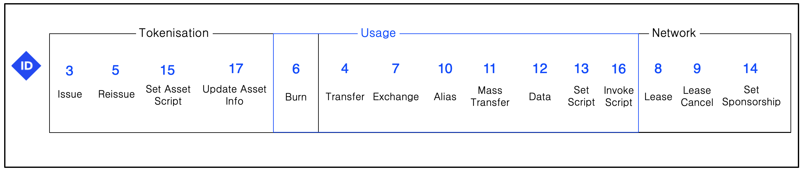

# Типы транзакций

В отличие от многих других блокчейнов, где есть 1 (Bitcoin) или 2 (Ethereum) типа транзакций, в Waves их нассчитывается 17 на момент написания этих строк. Ниже представлена схема с условным разделением всех актуальных типов транзакций на категории:



У некоторых уже могли возникнуть вопросы: "Почему у транзакций такой хаотичный порядок нумерации?, почему нумерация не идет последовательно хотя бы в рамках одной категории?".

Дело в том, что транзакции получали номера (они же ID) по мере их добавления в протокол. В этой части мы будем рассматривать транзакции по мере их появления в блокчейне.

В Waves есть два типа транзакций, которые сейчас не используются и которые вам точно не пригодятся - `Genesis` и `Payment`. Долго останавливаться на этих типах транзакций не будем.

## Genesis транзакция [deprecated]

`Genesis` транзакции были только в [самом первом блоке блокчейна](http://nodes.wavesplatform.com/blocks/at/1) и отвечали за распределение предвыпущенных токенов. Их сразу было 100 миллионов. Давайте посмотрим как выглядел `genesis` блок.

**Примечание:** Многие путают `genesis` блок и `genesis` транзакции. `Genesis` блок - самый первый блок в блокчейн сети (во всех блокчейнах принято так называть), который отличается от остальных блоков только отсутствие ссылки на предыдущий блок, ведь его попросту не было. `Genesis` блок содержит `genesis` транзакции, которые отвечают за первоначальное распределение выпущенных токенов Waves.

```json
{
  "reference": "67rpwLCuS5DGA8KGZXKsVQ7dnPb9goRLoKfgGbLfQg9WoLUgNY77E2jT11fem3coV9nAkguBACzrU1iyZM4B8roQ",
  "blocksize": 500,
  "signature": "FSH8eAAzZNqnG8xgTZtz5xuLqXySsXgAjmFEC25hXMbEufiGjqWPnGCZFt6gLiVLJny16ipxRNAkkzjjhqTjBE2",
  "totalFee": 0,
  "nxt-consensus": {
    "base-target": 153722867,
    "generation-signature": "11111111111111111111111111111111"
  },
  "fee": 0,
  "generator": "3P274YB5qseSE9DTTL3bpSjosZrYBPDpJ8k",
  "transactionCount": 6,
  "transactions": [
    {
      "type": 1,
      "id": "2DVtfgXjpMeFf2PQCqvwxAiaGbiDsxDjSdNQkc5JQ74eWxjWFYgwvqzC4dn7iB1AhuM32WxEiVi1SGijsBtYQwn8",
      "fee": 0,
      "timestamp": 1465742577614,
      "signature": "2DVtfgXjpMeFf2PQCqvwxAiaGbiDsxDjSdNQkc5JQ74eWxjWFYgwvqzC4dn7iB1AhuM32WxEiVi1SGijsBtYQwn8",
      "recipient": "3PAWwWa6GbwcJaFzwqXQN5KQm7H96Y7SHTQ",
      "amount": 9999999500000000
    },
    {
      "type": 1,
      "id": "2TsxPS216SsZJAiep7HrjZ3stHERVkeZWjMPFcvMotrdGpFa6UCCmoFiBGNizx83Ks8DnP3qdwtJ8WFcN9J4exa3",
      "fee": 0,
      "timestamp": 1465742577614,
      "signature": "2TsxPS216SsZJAiep7HrjZ3stHERVkeZWjMPFcvMotrdGpFa6UCCmoFiBGNizx83Ks8DnP3qdwtJ8WFcN9J4exa3",
      "recipient": "3P8JdJGYc7vaLu4UXUZc1iRLdzrkGtdCyJM",
      "amount": 100000000
    },
    {
      "type": 1,
      "id": "3gF8LFjhnZdgEVjP7P6o1rvwapqdgxn7GCykCo8boEQRwxCufhrgqXwdYKEg29jyPWthLF5cFyYcKbAeFvhtRNTc",
      "fee": 0,
      "timestamp": 1465742577614,
      "signature": "3gF8LFjhnZdgEVjP7P6o1rvwapqdgxn7GCykCo8boEQRwxCufhrgqXwdYKEg29jyPWthLF5cFyYcKbAeFvhtRNTc",
      "recipient": "3PAGPDPqnGkyhcihyjMHe9v36Y4hkAh9yDy",
      "amount": 100000000
    },
    {
      "type": 1,
      "id": "5hjSPLDyqic7otvtTJgVv73H3o6GxgTBqFMTY2PqAFzw2GHAnoQddC4EgWWFrAiYrtPadMBUkoepnwFHV1yR6u6g",
      "fee": 0,
      "timestamp": 1465742577614,
      "signature": "5hjSPLDyqic7otvtTJgVv73H3o6GxgTBqFMTY2PqAFzw2GHAnoQddC4EgWWFrAiYrtPadMBUkoepnwFHV1yR6u6g",
      "recipient": "3P9o3ZYwtHkaU1KxsKkFjJqJKS3dLHLC9oF",
      "amount": 100000000
    },
    {
      "type": 1,
      "id": "ivP1MzTd28yuhJPkJsiurn2rH2hovXqxr7ybHZWoRGUYKazkfaL9MYoTUym4sFgwW7WB5V252QfeFTsM6Uiz3DM",
      "fee": 0,
      "timestamp": 1465742577614,
      "signature": "ivP1MzTd28yuhJPkJsiurn2rH2hovXqxr7ybHZWoRGUYKazkfaL9MYoTUym4sFgwW7WB5V252QfeFTsM6Uiz3DM",
      "recipient": "3PJaDyprvekvPXPuAtxrapacuDJopgJRaU3",
      "amount": 100000000
    },
    {
      "type": 1,
      "id": "29gnRjk8urzqc9kvqaxAfr6niQTuTZnq7LXDAbd77nydHkvrTA4oepoMLsiPkJ8wj2SeFB5KXASSPmbScvBbfLiV",
      "fee": 0,
      "timestamp": 1465742577614,
      "signature": "29gnRjk8urzqc9kvqaxAfr6niQTuTZnq7LXDAbd77nydHkvrTA4oepoMLsiPkJ8wj2SeFB5KXASSPmbScvBbfLiV",
      "recipient": "3PBWXDFUc86N2EQxKJmW8eFco65xTyMZx6J",
      "amount": 100000000
    }
  ],
  "version": 1,
  "timestamp": 1460678400000,
  "height": 1
}
```

Можно заметить, что было 6 публичных ключей-получателей свеже выпущенных токенов Waves. У всех транзакций одинаковый timestamp и они все были бесплатными (`fee` равен нулю), потому что нечем еще было платить `fee` на момент создания этих транзакций.

Эти транзакции созданы не вручную, они генерируются автоматически специальной утилитой `genesis-generator`, который есть в репозитории ноды. Вам это может понадобится сделать, если вы захотите запустить свой приватный блокчейн. Как это сделать (и зачем) мы рассмотрим в одной из следующих глав.

Внимательные читатели могут спросить, почему в самой первой транзакции отправляется `9999999500000000` токенов, если было выпущено всего 100 миллионов? В Waves во всех транзакциях счет идет минимальными неделимыми единицами токена (fraction). У токена Waves количество знаков после запятой (decimals) равно 8, поэтому минимальная единица - одна сто миллионная. Если в поле `amount` любой транзакции стоит значение `100000000` (10^8), это обозначает на самом деле один целый токен Waves. В случае с `genesis` транзакцией, `9999999500000000` означает 99 999 995 токенов или 9999999500000000 минимальных единиц. Минимальные единицы Waves часто называют WAVELET.

## Payment транзакция [deprecated]

В момент запуска блокчейна Waves было реализовано всего 2 типа транзакций - уже рассмотренный тип `genesis` и `payment`, который позволял переводить токены Waves c одного аккаунта на другой. Примеры транзакции `payment` в JSON представлении можно посмотреть в [блоке под номером 2000](http://nodes.wavesplatform.com/blocks/at/2000).

```json
    {
      "senderPublicKey": "6q5VhGeTanU5T8vWx6Jka3wsptPKSSHA9uXHwdvBMTMC",
      "amount": 10000000000,
      "sender": "3PGj6P4Mfzgo24i8cG3nhLU6uktF6s5LVCT",
      "feeAssetId": null,
      "signature": "3gzk9QyfqQGvsU8A4zMMorpKTcFpdG7UtC4c5E7ds9MGMCMSyp6JZymQJoCjUSJQ8AaSWQDQwNmQ5F46ud4ofA5o",
      "proofs": [
        "3gzk9QyfqQGvsU8A4zMMorpKTcFpdG7UtC4c5E7ds9MGMCMSyp6JZymQJoCjUSJQ8AaSWQDQwNmQ5F46ud4ofA5o"
      ],
      "fee": 1,
      "recipient": "3P59ixWkqiEnL7RJoXtZewgbatKBZo8bG15",
      "id": "3gzk9QyfqQGvsU8A4zMMorpKTcFpdG7UtC4c5E7ds9MGMCMSyp6JZymQJoCjUSJQ8AaSWQDQwNmQ5F46ud4ofA5o",
      "type": 2,
      "timestamp": 1465865163143
    }
```

`Payment` транзакция умеет отправлять только Waves токены (не кастомные ассеты) с одного адреса на другой. Она стала устаревшей с появлением `Transfer` транзакций, которые умеют отправлять как токены Waves, так и кастомные токены, поэтому сейчас `Payment` уже нигде не используется.

## Issue транзакция

