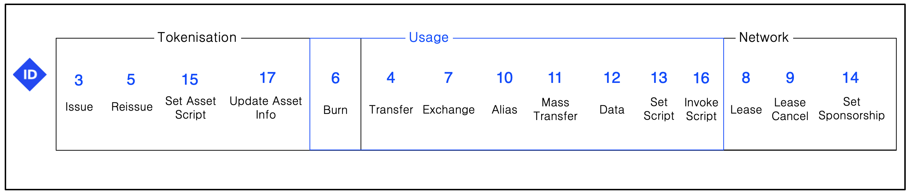

# Глава 5. Транзакции

В отличие от многих других блокчейнов, где есть 1 (Bitcoin) или 2 (Ethereum) типа транзакций, в Waves на момент написания этих строк их насчитывается 17. Ниже представлена схема с условным разделением всех актуальных типов транзакций на категории:



У вас уже могли возникнуть вопросы: "Почему у транзакций такой хаотичный порядок нумерации? Почему нумерация не идет последовательно хотя бы в рамках одной категории?".

Дело в том, что транзакции получали номера (они же ID) по мере их добавления в протокол. В этой части мы будем рассматривать транзакции в таком же порядке, то есть по мере их появления в блокчейне.

**Важно: у многих типов транзакций есть несколько версий, в этой книге мы будем рассматривать последние актуальные версии в Mainnet.**

Работа с транзакциями осуществуется с помощью API ноды, который позволяет как получать информацию о транзакциях, так и отправлять их. Для вас, как для разработчиков, транзакция в большинстве случаев будет выглядеть как простой JSON:

```json
{
  "senderPublicKey":"CRxqEuxhdZBEHX42MU4FfyJxuHmbDBTaHMhM3Uki7pLw",
  "amount":1000000000,"signature":"4W9nWkfRm62rTQiuZX6bowWmDnz5n3cKhCZmLcYgivK53mBt3TzH6Z52fV6fXPSZn5bZc97rNo76usnNEoQcTHaq",
  "fee":100000,
  "type":4,
  "version":1,
  "attachment":"",
  "sender":"3NBVqYXrapgJP9atQccdBPAgJPwHDKkh6A8",
  "feeAssetId":null,
  "proofs":["4W9nWkfRm62rTQiuZX6bowWmDnz5n3cKhCZmLcYgivK53mBt3TzH6Z52fV6fXPSZn5bZc97rNo76usnNEoQcTHaq"],
  "assetId":null,
  "recipient":"3N78bNBYhT6pt6nugc6ay1uW1nLEfnRWkJd",
  "feeAsset":null,
  "id":"8W9BkioPSWmPfDjcTFGaCy8vLEmcwkzJeSWno1s3Wra7",
  "timestamp":1485529237072,
  "height":56
}
```

Сама нода хранит транзакции в бинарном представлении, а не в виде JSON, но в момент запроса по API кодирует в JSON и отдает в таком виде. Принимает она ее тоже в виде JSON. В REST API ноды есть следующие полезные эндпоинты:

`GET /transactions/info/{id}` - получить информацию об одной транзакции

`GET /transactions/address/{address}/limit/{limit}` - получить транзакции по адресу

`GET /blocks/at/{height}` - получить список всех транзакций в блоке

## Подпись транзакций

У всех транзакций есть важное поле - `senderPublicKey`, которое определяет от имени какого аккаунта совершается действие. Чтобы транзакция ("действие") считалась валидной, необходимо, чтобы подпись транзакции соответствовала этому публичному ключу (случаи со смарт-аккаунтами сейчас не рассматриваем).

Криптографические функции подписи ничего не знают про транзакции, так как они работают с байтами. В случае Waves, для подписания транзакций необходимо байты транзакции расположить в правильном порядке и передать функции подписи вместе с приватным ключом, в итоге получим подпись.

```js
signature = sign(transactionBytes, privateKey)
```

Правильный порядок байтов для каждой транзакции описан в документации. Криптография выходит за пределы этой книги, но вы можете найти примеры правильного порядка байт для разных типов транзакций в [JS библиотеке Marshall на Github](https://github.com/wavesplatform/marshall).

Подписание транзакций делается обычно на стороне клиентского приложения, но сама нода так же умеет подписывать транзакции, отправляемые через API. Надо понимать, что нода такую транзакцию подпишет тем приватным ключом, который задан у нее в конфигурации. **Подписать транзакцию от произвольного отправителя с помощью REST API нельзя.** Многие разработчики думают, что им необходимо получить API key, чтобы подписать свою транзакцию с помощью ноды, но это будет работать только в том случае, есть в конфигурации задан приватный ключ от того аккаунта, который должен совершать действие.

## Жизненный цикл транзакции

Давайте разберем все стадии работы с транзакцией на примере одного действия - отправки токена от одного пользователя другому. У нас возникло желание отправить токены с нашего аккаунта, от которого мы знаем seed фразу (`A` в нашем примере). Отправлять будем на аккаунт с публичным ключом `B`. Первым делом нам необходимо задать параметры транзакции:

```js
const params = {
  amount: 300000000,
  recipient: address('B'),
  feeAssetId: null,
  assetId: null,
  attachment: 'TcgsE5ehTSPUftEquDt',
  fee: 100000,
}
```

Поля транзакции мы разберем в следующей части этой главы. Сейчас сконцентрируемся на последовательности действий. Чтобы получить транзакцию вместе с подписью для наших параметров, мы используем библиотеку `waves-transactions`. Функции `transfer` мы передаем обозначенные выше параметры и сид-фразу. В итоге, мы получаем JavaScript объект, который будет содержать все указанные нами поля, а так же подпись в массиве `proofs`, время подписания транзакции (`timestamp`) и публичный ключ отправителя (аккаунта с сид фразой `A`) в поле `senderPublicKey`.

```js
const signedTransferTx = transfer(params, 'A');
broadcast(signedTransferTx);
```

Библиотека от нас скрывает криптографию и подготовительный этап - формирование правильного порядка байт для подписи. Подписанная транзакция в форме JS объекта может быть отправлена в любую ноду, у которой открыт API. Запрос отправляется на `POST /transactions/broadcast` в виде JSON. Нода примет транзацию, если нет никаких проблем - подпись валидная, хватает токенов на балансе нашего аккаунта для совершения транзакции и т.д. Провалидированная транзакция попадет в UTX ноды, куда мы отправляли запрос, а она уже дальше будет рассылать информацию об этой транзакции всем нодам, с которыми она соединена.

### UTX

UTX - список транзакций, которые находятся в ожидании попадания в блок. То есть, кто-то их отправил и нода приняла транзакцию, но транзакция в блок пока не попала. В Waves есть определенные особенности, связанные с тем, как такие транзакции обрабатываются. Как транзакция может попасть в UTX? Существует всего 2 способа для этого:

- Кто-то отправит транзакцию на эту ноду (c помощью REST API или gRPC)
- Нода получит транзакция по бинарному протоколу от другой ноды в сети

В конечном итоге можно сказать, что почти всегда транзакции в сеть приходят через API, но не объязательно, чтобы это был API данной конкретной ноды.

У транзакции, которая попала в UTX, есть 2 варианта дальнейшего развития событий:

- В какой-то момент времени она будет добавлена в блок одним из майнеров
- Транзакция станет невалидной и будет удалена из UTX (и никогда не сможет попасть в блок). Транзакция может стать невалидной по нескольким причинам - изменилось состояние блокчейна (другая транзакция попала в блок и изменила баланс отправителя, скрипт на аккаунте или ассете теперь уже возвращает `false` и т.д.), истекло время жизни транзакции (сейчас в сети Waves `timestamp` транзакции может отличаться на -2 или +1.5 часа от текущего времени блокчейна).

Время жизни транзакции может истечь только по причине загрузки сети на все 100%. Ноды в Waves добавляют в блок транзакции поочередно, начиная с самых выгодных для них (с наибольшей комиссией за байт). Если в момент отправки нашей транзакции перевода токенов, в UTX было много транзакций с большей комиссией, то майнеры не будут добавлять в блок нашу, ведь у блока есть лимит на размер (1 МБ) и количество (6000 транзакций). Майнеры будут производить блоки максимального размера с самыми выгодными для них транзакциями. Если такое продолжится на протяжении 90 минут, то наша транзакция станет невалидной. На самом деле сортировка транзакция в UTX майнерами производится не только на основе размера коммиссии, поэтому особенности работы UTX мы рассмотрим в дальнейшем.

**Для многих новичков становится неожиданностью, что в Waves в блоки могут попадать транзакции "из прошлого" и "из будущего", у которых `timestamp` на 120 минут меньше или 90 минут больше настоящего времени.** В некоторых случаях необходимо это учитывать при разработке своих приложений.
