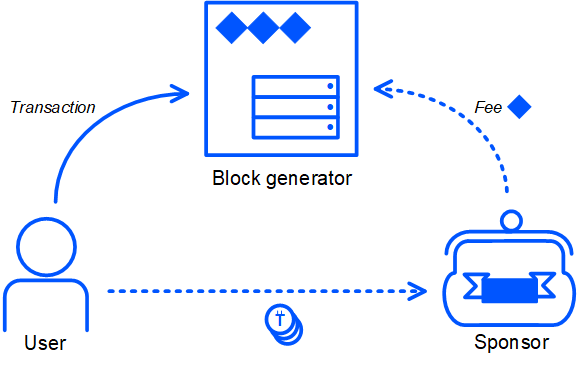
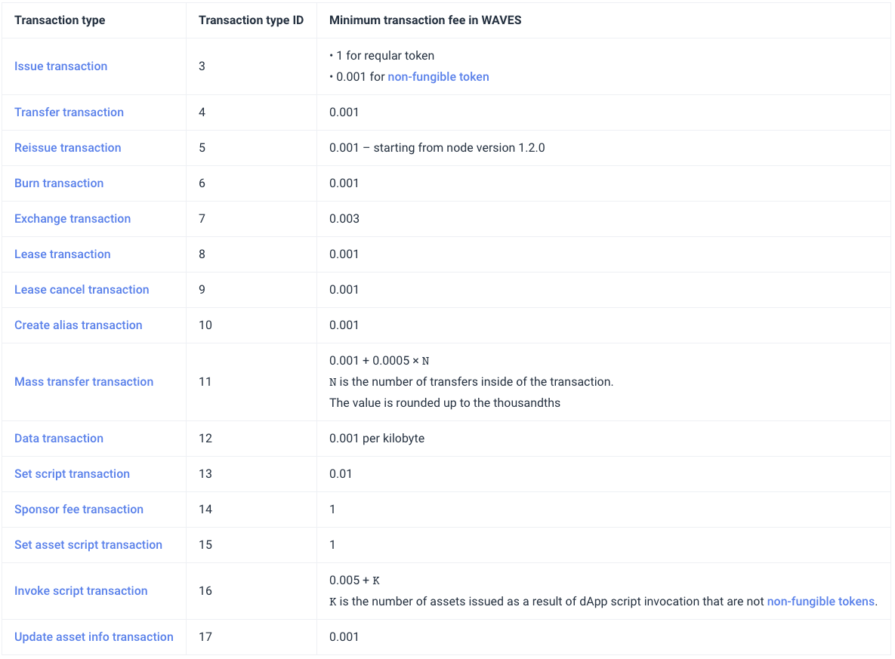

# Transaction types

To use the Waves blockchain as efficiently as possible and understand all of its capabilities, you need to understand the types of transactions and their features. In this section, we'll break down all types and discuss potential pitfalls.

There are two types of transactions in Waves that are currently not used and that you will definitely not use when working on the main network - `Genesis` and` Payment` transactions.

## Genesis transaction (type = 1) [deprecated]

`Genesis` transactions were only in the [very first block of the blockchain] (http://nodes.wavesplatform.com/blocks/at/1) and were responsible for the distribution of pre-issued tokens (there were 100 million of them). Let's see what the genesis block looked like.

** Note: ** Many people confuse the `genesis` block and the` genesis` transaction. The `Genesis` block is the very first block in the blockchain network (in all blockchains it is customary to call it that), which differs from the rest of the blocks only by the absence of a reference to the previous block, since the previous block simply did not exist. The `Genesis` block contains the` genesis` transactions that are responsible for the initial distribution of issued Waves tokens. The very first block on the Waves network is shown below:

``` 'json
{
  "reference": "67rpwLCuS5DGA8KGZXKsVQ7dnPb9goRLoKfgGbLfQg9WoLUgNY77E2jT11fem3coV9nAkguBACzrU1iyZM4B8roQ",
  "blocksize": 500,
  "signature": "FSH8eAAzZNqnG8xgTZtz5xuLqXySsXgAjmFEC25hXMbEufiGjqWPnGCZFt6gLiVLJny16ipxRNAkkzjjhqTjBE2",
  "totalFee": 0,
  "nxt-consensus": {
    "base-target": 153722867,
    "generation-signature": "11111111111111111111111111111111"
  },
  "fee": 0,
  "generator": "3P274YB5qseSE9DTTL3bpSjosZrYBPDpJ8k",
  "transactionCount": 6,
  "transactions": [
    {
      "type": 1,
      "id": "2DVtfgXjpMeFf2PQCqvwxAiaGbiDsxDjSdNQkc5JQ74eWxjWFYgwvqzC4dn7iB1AhuM32WxEiVi1SGijsBtYQwn8",
      "fee": 0,
      "timestamp": 1465742577614,
      "signature": "2DVtfgXjpMeFf2PQCqvwxAiaGbiDsxDjSdNQkc5JQ74eWxjWFYgwvqzC4dn7iB1AhuM32WxEiVi1SGijsBtYQwn8",
      "recipient": "3PAWwWa6GbwcJaFzwqXQN5KQm7H96Y7SHTQ",
      "amount": 9999999500000000
    },
    {
      "type": 1,
      "id": "2TsxPS216SsZJAiep7HrjZ3stHERVkeZWjMPFcvMotrdGpFa6UCCmoFiBGNizx83Ks8DnP3qdwtJ8WFcN9J4exa3",
      "fee": 0,
      "timestamp": 1465742577614,
      "signature": "2TsxPS216SsZJAiep7HrjZ3stHERVkeZWjMPFcvMotrdGpFa6UCCmoFiBGNizx83Ks8DnP3qdwtJ8WFcN9J4exa3",
      "recipient": "3P8JdJGYc7vaLu4UXUZc1iRLdzrkGtdCyJM",
      "amount": 100000000
    },
    {
      "type": 1,
      "id": "3gF8LFjhnZdgEVjP7P6o1rvwapqdgxn7GCykCo8boEQRwxCufhrgqXwdYKEg29jyPWthLF5cFyYcKbAeFvhtRNTc",
      "fee": 0,
      "timestamp": 1465742577614,
      "signature": "3gF8LFjhnZdgEVjP7P6o1rvwapqdgxn7GCykCo8boEQRwxCufhrgqXwdYKEg29jyPWthLF5cFyYcKbAeFvhtRNTc",
      "recipient": "3PAGPDPqnGkyhcihyjMHe9v36Y4hkAh9yDy",
      "amount": 100000000
    },
    {
      "type": 1,
      "id": "5hjSPLDyqic7otvtTJgVv73H3o6GxgTBqFMTY2PqAFzw2GHAnoQddC4EgWWFrAiYrtPadMBUkoepnwFHV1yR6u6g",
      "fee": 0,
      "timestamp": 1465742577614,
      "signature": "5hjSPLDyqic7otvtTJgVv73H3o6GxgTBqFMTY2PqAFzw2GHAnoQddC4EgWWFrAiYrtPadMBUkoepnwFHV1yR6u6g",
      "recipient": "3P9o3ZYwtHkaU1KxsKkFjJqJKS3dLHLC9oF",
      "amount": 100000000
    },
    {
      "type": 1,
      "id": "ivP1MzTd28yuhJPkJsiurn2rH2hovXqxr7ybHZWoRGUYKazkfaL9MYoTUym4sFgwW7WB5V252QfeFTsM6Uiz3DM",
      "fee": 0,
      "timestamp": 1465742577614,
      "signature": "ivP1MzTd28yuhJPkJsiurn2rH2hovXqxr7ybHZWoRGUYKazkfaL9MYoTUym4sFgwW7WB5V252QfeFTsM6Uiz3DM",
      "recipient": "3PJaDyprvekvPXPuAtxrapacuDJopgJRaU3",
      "amount": 100000000
    },
    {
      "type": 1,
      "id": "29gnRjk8urzqc9kvqaxAfr6niQTuTZnq7LXDAbd77nydHkvrTA4oepoMLsiPkJ8wj2SeFB5KXASSPmbScvBbfLiV",
      "fee": 0,
      "timestamp": 1465742577614,
      "signature": "29gnRjk8urzqc9kvqaxAfr6niQTuTZnq7LXDAbd77nydHkvrTA4oepoMLsiPkJ8wj2SeFB5KXASSPmbScvBbfLiV",
      "recipient": "3PBWXDFUc86N2EQxKJmW8eFco65xTyMZx6J",
      "amount": 100000000
    }
  ],
  "version": 1,
  "timestamp": 1460678400000,
  "height": 1
}
```

You can see that there were 6 public keys-recipients of the newly issued Waves tokens. All transactions have the same `timestamp` and they were all free (the` fee` is zero) because there was nothing else to pay the `fee` at the time these transactions were created.

These transactions are not created manually, they are generated automatically by the special utility `genesis-generator`, which is in the node repository. You may need to do this if you want to launch your private blockchain. How to do this (and why) we will look at in one of the next chapters.

> Attentive readers may ask why `9999999500000000` tokens are sent in the very first transaction if only 100 million were issued? In Waves, all transactions are invoiced in minimal indivisible token units (fraction). The Waves token has 8 decimals, so the minimum unit is one hundred millionth. If the `amount` field of any transaction contains the value` 100000000` (10 ^ 8), this actually means one whole Waves token. In the case of a `genesis` transaction,` 9999999500000000` means 99,999,995 tokens or 9999999500000000 minimum units. Waves' smallest units are often referred to as WAVELET.

## Payment transaction (type = 2) [deprecated]

At the time of the launch of the Waves blockchain, only 2 types of transactions were implemented - the already considered type `genesis` and` payment`, which allowed transferring Waves tokens from one account to another. Examples of the `payment` transaction in JSON representation can be found in [block 2000](http://nodes.wavesplatform.com/blocks/at/2000).

``` 'json
    {
      "senderPublicKey": "6q5VhGeTanU5T8vWx6Jka3wsptPKSSHA9uXHwdvBMTMC",
      "amount": 10000000000,
      "sender": "3PGj6P4Mfzgo24i8cG3nhLU6uktF6s5LVCT",
      "feeAssetId": null,
      "signature": "3gzk9QyfqQGvsU8A4zMMorpKTcFpdG7UtC4c5E7ds9MGMCMSyp6JZymQJoCjUSJQ8AaSWQDQwNmQ5F46ud4ofA5o",
      "proofs": [
        "3gzk9QyfqQGvsU8A4zMMorpKTcFpdG7UtC4c5E7ds9MGMCMSyp6JZymQJoCjUSJQ8AaSWQDQwNmQ5F46ud4ofA5o"
      ],
      "fee": 1,
      "recipient": "3P59ixWkqiEnL7RJoXtZewgbatKBZo8bG15",
      "id": "3gzk9QyfqQGvsU8A4zMMorpKTcFpdG7UtC4c5E7ds9MGMCMSyp6JZymQJoCjUSJQ8AaSWQDQwNmQ5F46ud4ofA5o",
      "type": 2,
      "timestamp": 1465865163143
    }
```

A `Payment` transaction can only send Waves tokens (not other ones issued on the platform) from one address to another. It became obsolete with the advent of `Transfer` transactions that can send both Waves tokens and custom tokens, so now` Payment` is no longer used anywhere.

## Issue transaction (type = 3)

In the section about tokens, we have already discussed in detail how to release your asset using the `Issue` transaction, so now I will not dwell on how to use it. One has only to say that the distinctive feature of the `Issue` transaction is that there are 2 fundamentally different options for issuing a token:

- issuance of a unique token (aka non-fungible token, NFT)
- issue of a regular token

Issuing a unique token differs in that the parameters `amount`,` reissuable`, `decimals` must have predefined values ​​-` 1`, `false` and` 0`, respectively. If this condition is met, the minimum commission will be 0.001 Waves. If these parameters differ (at least one of the parameters), then the token is considered normal and the minimum issue commission will be 1 Waves.

An example JSON representation of the `Issue` transaction is shown below:

``` 'json
{
    senderPublicKey: "7nSKRN4XZiD3TGYsMRQGQejzP7x8EgiKoG2HcY7oYv6r",
    quantity: 210000000,
    signature: "3Vj8M9tkVZmnjdYAKKN3GzAtV9uQDX5hhgUfXQDdvZsk2AmvqQum3oGBJqdjALVHXX2ibLAZHeruwjNXR46WgBnm",
    fee: 100000000,
    description: "",
    type: 3,
    version: 1,
    reissuable: true,
    sender: "3PAJ6bw7kvSPf6Q9kAgfSLzmpFspZmsi1ki",
    feeAssetId: null,
    proofs: [
"3Vj8M9tkVZmnjdYAKKN3GzAtV9uQDX5hhgUfXQDdvZsk2AmvqQum3oGBJqdjALVHXX2ibLAZHeruwjNXR46WgBnm"
],
    script: null,
    assetId: "oWgJN6YGZFtZrV8BWQ1PGktZikgg7jzGmtm16Ktyvjd",
    decimals: 1,
    name: "ihodl",
    id: "oWgJN6YGZFtZrV8BWQ1PGktZikgg7jzGmtm16Ktyvjd",
    timestamp: 1528867061493,
    height: 1039500
}
```

> Important: if a token is issued without a script, then it cannot be added to it later, so if you want to add a script in the future, but do not have this script yet, then specify `AwZd0cYf` as a script (` true` in the compiled base64 version)

## Tranfer transaction (type = 4)

The `Tranfser` transaction came to replace the` Payment` transaction, because `Payment` did not allow sending tokens created with the` Issue` transaction. Currently, the `Transfer` transaction is the most frequent one according to [dev.pywaves.org](http://dev.pywaves.org/txs/) and accounts for about 70% of transactions on the network. Sending a `Transfer` transaction is similar to sending most token-related transactions:

```js

const {transfer} = require ('@ waves / waves-transactions');

const seed = 'example seed phrase';

// Transfering 3 WAVES
const params = {
  amount: 300000000,
  recipient: '3P23fi1qfVw6RVDn4CH2a5nNouEtWNQ4THs',
  feeAssetId: null,
  assetId: null,
  attachment: 'TcgsE5ehTSPUftEquDt',
  fee: 100000,
}

const signedTransferTx = transfer (params, seed);
broadcast (signedTransferTx);

```

The example above will generate a transaction from the account with the seed phrase `example seed phrase`, automatically substitute additional fields (` timestamp`, `senderPublicKey`,` proofs`) into the created transaction, sign it with a private key from the specified seed phrase and add the transaction signature to the array `proofs`.

The recipient of the transaction is the address `3P23fi1qfVw6RVDn4CH2a5nNouEtWNQ4THs`, and we send Waves tokens. To calculate how many tokens are sent, we need to remember that the transaction indicates the value of `amount` in the minimum fractions of this token. To get it in whole units, you need to divide `300000000` by` 10 ^ decimals`. `300000000 / (10 ^ 8) = 3`.

The `Transfer` transaction has several interesting features:

- It supports sponsoring transactions, so in the field `feeAssetId` you can specify the` assetId` of some token that you have and is sponsored by the creator, then you will pay a fee in this token. In our case, `null` is specified, so the commission will be paid in Waves tokens.
- The transaction has an `attachment` field that can contain up to 140 bytes of information. In the `waves-transactions` library, the` attachment` value must be passed in the `base58` format, so you see` TcgsE5ehTSPUftEquDt`, although in the "human" representation it can be read as `HelloWavesBook`.

The `Transfer` transaction allows you to specify 0 in the` amount` field, that is, to send 0 tokens to the recipient. Some users use this feature to send `Transfer` transactions as" messages "or events that may trigger other actions outside the blockchain.

An example of a `Transfer` transaction is shown below:

``` 'json
{
    senderPublicKey: "CXpZvRkJqBfnAw3wgaRbeNjtLJcithoyQQQSzGQZRF3x",
    amount: 32800000000,
    signature: "4cR2NAor9WjeTbysg2QMerkgymc5RLrX8PPjdXkUkWEc7BFBKMCCj8RKF7X1UchbvtEGoqGyQh62MDq5KoXsnCzg",
    fee: 100000,
    type: 4,
    version: 1,
    attachment: "",
    sender: "3P4FoAakEyk78TxUBcXH4uZXLaSE5BiDgjz",
    feeAssetId: null,
    proofs: [
"4cR2NAor9WjeTbysg2QMerkgymc5RLrX8PPjdXkUkWEc7BFBKMCCj8RKF7X1UchbvtEGoqGyQh62MDq5KoXsnCzg"
],
    assetId: null,
    recipient: "3PNX6XwMeEXaaP1rf5MCk8weYeF7z2vJZBg",
    feeAsset: null,
    id: "JAutkv1Nk4xVrkb4fkacS4451VvyHC3iJtEDfBRD7rwr",
    timestamp: 1528867058828,
    height: 1039500
}
```

## Reissue transaction (type = 5)

If, when issuing a token using the `Issue` transaction, set the` reissuable` flag to `true`, then the creator of the token gets the opportunity to reissue the token. The history of `reissuable` transactions in Waves is a bit strange, as you can find tokens on the blockchain that had the` reissuable` flag equal to `false` at the time of creation, but were reissued. These tokens was only 4, so their assetId: `6SGeUizNdhLx8jEVcAtEsE7MGPHGYyvL2chdmPxDh51K`,` UUwsxTvvG7LiN7yaAKvNU48JHcSwQ3q1HvsXyAgc9fL`, `3DhpxLxUrotfXHcWKr4ivvLNVQUueJTSJL5AG4qB2E7U`,` CH1LNr9ASLVqSHDb482ZzSA5rBVLDtF5QbfECGgwE8bh`. This became possible thanks to a bug in the node's code, which allowed re-issuing non-reissued tokens. Don't be surprised if you find reissued `non-reissuable` tokens in the history of mainnet Waves.

An example of a `Reissue` transaction is shown below:

``` 'json
{
    senderPublicKey: "4X2Fv5XaDwBj2hjRghfqmsQDvBHqSa2zBUgZPDgySSJG",
    quantity: 10000000000000000,
    signature: "5nNrLV46rVzQzeScz3RmZF4rzaV2XaSjT9kjtHoyrBzAj3iVZM9Gy6t5Paho7xRx9dyqzj1AKyWYQsgL2nFa7jYU",
    fee: 1000000,
    type: 5,
    version: 1,
    reissuable: true,
    sender: "3P6ms9EotRX8JwSrebeTXYVnzpsGCrKWLv4",
    feeAssetId: null,
    chainId: null,
    proofs: [
"5nNrLV46rVzQzeScz3RmZF4rzaV2XaSjT9kjtHoyrBzAj3iVZM9Gy6t5Paho7xRx9dyqzj1AKyWYQsgL2nFa7jYU"
],
    assetId: "AC3KZWmywTEYrcQwpjg4sQiWxkZ2TZmv81JAvDmsoQvy",
    id: "6qd8QbnFrKEibTr26JyNh1hc4KaafGQYStyShtXdNk3v",
    timestamp: 1528733511933,
    height: 1037381
}
```

## Burn transaction (type = 6)

A token burn transaction allows you to burn any number of tokens of the same type. The only condition is that these tokens must be on your account and the token script must not prohibit burning.

An example of a `Burn` transaction is shown below:

``` 'json
{
    senderPublicKey: "EhuzuzEWHhZGo1th6YGy34AecoRP4sVi863xXCQUmgUT",
    amount: 10000000000,
    signature: "5HdfqY47Pm4G6h67K9ZpN7jQ4NKr9hsNsmTAtyFD5FhBPr3J9kNxodhYn6hMSieKE7UmYZvSohv7XJpyjKvGCfTC",
    fee: 100000,
    type: 6,
    version: 1,
    sender: "3PAjApsrjJWGmRDbGo65gGgrN2hFJroAZDC",
    feeAssetId: null,
    proofs: [
"5HdfqY47Pm4G6h67K9ZpN7jQ4NKr9hsNsmTAtyFD5FhBPr3J9kNxodhYn6hMSieKE7UmYZvSohv7XJpyjKvGCfTC"
],
    assetId: "56w2Jbj8MGKwSWyTXvCzkqKKHiyX7C2zrgCQb2CEwM52",
    id: "EzeiYzYPwyJNEgofQrE23rpqaYERjUSnCaXZ84vUDoec",
    timestamp: 1528814759445,
    height: 1038647
}
```

## Exchange transaction (type = 7)

In the previous chapter, we talked a lot about the token exchange procedure, the work of the order matcher and the `Exchange` transactions. Among other things, they touched upon the topic that a transaction contains orders, and that is why this transaction is the most complex in JSON representation:

``` 'json
{
    senderPublicKey: "7kPFrHDiGw1rCm7LPszuECwWYL3dMf6iMifLRDJQZMzy",
    amount: 74,
    signature: "2p1BS5BPkMW4C3C6vL8MsrQ8CBQRQqDoYieaZcxeMAq5zvAsm6T4N5DDN6MfPx8emVmbHfibZRsok2v2Ss45e1mj",
    fee: 300000,
    type: 7,
    version: 1,
    sellMatcherFee: 63610,
    sender: "3PJaDyprvekvPXPuAtxrapacuDJopgJRaU3",
    feeAssetId: null,
    proofs: [
"2p1BS5BPkMW4C3C6vL8MsrQ8CBQRQqDoYieaZcxeMAq5zvAsm6T4N5DDN6MfPx8emVmbHfibZRsok2v2Ss45e1mj"
],
    price: 103526336,
    id: "GHKhG3CWNfXAPWprk9bHSE4rxN6QfNDe3d3rZGaDLWhm",
    order2: {
    version: 1,
    id: "5C8qLi2eK92CJtBqXbL9pMuQ2R9VpRMaJ6NGACfxMBCn",
    sender: "3P7DsCo8TN5t1PNz45exhLe6vKFkTQJYrNb",
    senderPublicKey: "6mYVd69bZsLYW9gpxu3Vjneaf4xpZPnKYiLFuGXJQKQw",
    matcherPublicKey: "7kPFrHDiGw1rCm7LPszuECwWYL3dMf6iMifLRDJQZMzy",
    assetPair: {
    amountAsset: "725Yv9oceWsB4GsYwyy4A52kEwyVrL5avubkeChSnL46",
    priceAsset: null
},
    orderType: "sell",
    amount: 349,
    price: 103526336,
    timestamp: 1528814695617,
    expiration: 1528814995617,
    matcherFee: 300000,
    signature: "4DSQvXBLA4U4mtTRzjz62Ci757TZsys8phWbfnCmwvrKDhYFfB8kEknJ9fknAfWkJua7wN4EPbdrSLPgRShaxTsj",
    proofs: [
"4DSQvXBLA4U4mtTRzjz62Ci757TZsys8phWbfnCmwvrKDhYFfB8kEknJ9fknAfWkJua7wN4EPbdrSLPgRShaxTsj"
]
},
    order1: {
    version: 1,
    id: "Eiy6wSzu3aZu3V5Mi7VN54Vmu5KQE18nEQ3j5bJU2WYK",
    sender: "3PMFLMN9GG1coCXRn26vUmF2vtCCd4RDWRR",
    senderPublicKey: "Dk3r1HwVK1Ktp3MJCoAspNyyRpLFcs2h5SKsoV5F3Rvd",
    matcherPublicKey: "7kPFrHDiGw1rCm7LPszuECwWYL3dMf6iMifLRDJQZMzy",
    assetPair: {
    amountAsset: "725Yv9oceWsB4GsYwyy4A52kEwyVrL5avubkeChSnL46",
    priceAsset: null
},
    orderType: "buy",
    amount: 74,
    price: 103526336,
    timestamp: 1528814695596,
    expiration: 1528814995596,
    matcherFee: 300000,
    signature: "5kM8NRVxu4xtDUwz7GCVqyHbeszjXheJn1f7Q5Kpa4zdkeXe8k1kNENAU1YVNXyxNjMHCwtY9mwUkBpZWPo2CHWf",
    proofs: [
"5kM8NRVxu4xtDUwz7GCVqyHbeszjXheJn1f7Q5Kpa4zdkeXe8k1kNENAU1YVNXyxNjMHCwtY9mwUkBpZWPo2CHWf"
]
},
    buyMatcherFee: 300000,
    timestamp: 1528814695635,
    height: 1038644
}
```

As you can see, the transaction contains the fields `order1` (an order of the` buy` type) and `order2` (an order of the` sell` type). There is also a signature in the `proofs` array, which is the signature of the matcher (not the order senders!), The size of the commission for the match (` sellMatcherFee`), the commission for the node that will mine the block (the `fee` field for the entire transaction and not for the order ).

The values ​​of the `matcherPublicKey` fields in the orders must match the` senderPublicKey` field for the `Exchange` transaction, which ensures that no other matcher can perform an exchange operation using these orders.

Forming an `Exchange` transaction in most cases is not necessary for users and developers, therefore it is not supported in many libraries for different programming languages. Another thing is orders, the formation of which is necessary for bots and many user interfaces. Formation of an order using `waves-tranasctions` does not fundamentally differ from the formation of a transaction:

``` js
const {order} = require ('@ waves / waves-transactions')

const seed = 'b716885e9ba64442b4f1263c8e2d8671e98b800c60ec4dc2a27c83e5f9002b18'

const params = {
  amount: 100000000, // 1 waves
  price: 10, // for 0.00000010 BTC
  priceAsset: '8LQW8f7P5d5PZM7GtZEBgaqRPGSzS3DfPuiXrURJ4AJS',
  matcherPublicKey: '7kPFrHDiGw1rCm7LPszuECwWYL3dMf6iMifLRDJQZMzy',
  orderType: 'buy'
}


const signedOrder = order (params, seed)
```

Please note that unlike the examples with transactions, the example does not use the `broadcast` function to send the transaction, because the` broadcast` sends the transaction to the node, and we need to send the order to the matcher. You can find information about the matcher API in the [waves.exchange documentation](https://docs.waves.exchange/en/waves-matcher/matcher-api), since Waves.exchange works on the basis of the matcher.

## Lease and Lease Cancel transactions (types 8 and 9)

At the very beginning of this book, we touched on the topic of leasing a little, which allows you to lease your tokens to other nodes "for rent" to generate blocks. To do this, you need to send a transaction of type `Lease`.

``` js
const {lease} = require ('@ waves / waves-transactions')

const seed = 'example seed phrase'

const params = {
  amount: 100,
  recipient: '3P23fi1qfVw6RVDn4CH2a5nNouEtWNQ4THs',
  fee: 100000
}

const signedLeaseTx = lease (params, seed)
broadcast (signedLeaseTx);
```

As you can see, the transaction is extremely simple, we indicate the recipient in the `recipient` field in the form of an address or an alias (we'll talk about them below) and the amount we want to lease. It should be borne in mind that these tokens will participate in mining only 1000 blocks after they are leased.

The sender of the lease can cancel the lease at any time, again gaining access to them for trading, transfers or mining at their address. To do this, you need to send the transaction `LeaseCancel`:

``` js
const {cancelLease} = require ('@ waves / waves-transactions')

const seed = 'example seed phrase'

const params = {
  leaseId: '2fYhSNrXpyKgbtHzh5tnpvnQYuL7JpBFMBthPSGFrqqg',
  senderPublicKey: '3SU7zKraQF8tQAF8Ho75MSVCBfirgaQviFXnseEw4PYg', // optional, by default derived from seed
  timestamp: Date.now (), // optional
  fee: 100000, // minimal value
  chainId: 'W' // optional
}

const signedCancelLeaseTx = cancelLease (params, seed)
broadcast (signedCancelLeaseTx);
```

A lease cancellation transaction requires the transfer of the `ID` of the lease transaction. You can only cancel the entire lease transaction. For example, if you lease 1000 Waves to any node of one transaction, you will not be able to withdraw part of this amount - it can only be canceled in its entirety.

Please also note that this transaction specifies the `chainId`, while in the lease sending transaction, this is not required. Try to guess why.

> The answer is simple: in the lease sending transaction there is a `recipient` field, where the address is indicated (which already contains the chainId in itself), and in the lease cancellation transaction there is no` recipient` field, therefore, to make it impossible to send the same transactions in different networks, you have to specify the network byte. But if you use the `waves-transactions` library, then it will substitute the network byte for the Mainnet itself to simplify development and make your code cleaner and easier.

Another difference between canceling a lease and sending it on lease is that the cancellation takes effect as soon as it enters the blockchain, without waiting for 1000 blocks.

## Alias ​​transaction (type = 10)

Waves has a unique feature that many other blockchains do not have - the presence of aliases. It is sometimes extremely inconvenient to use addresses for transactions, they are long and impossible to remember, so each account can create aliases for itself. Alias ​​can be simple and easy to remember. In any transaction on the Waves network, in the `recipient` field, you can specify not only the address, but also the alias.

Ethereum has a slightly similar concept of ENS, which is built on the principles of DNS, with different levels (namespace) and management through smart contracts. In Waves, aliases are part of the protocol and all are in the global namespace, without division into domains and subdomains. One account can create an unlimited number of aliases by sending a special type of transaction:

``` js
const {alias} = require ('@ waves / waves-transactions')

const seed = 'example seed phrase'

const params = {
  alias: 'new_alias',
  chainId: 'W'
}

const signedAliasTx = alias (params, seed)
broadcast (signedAliasTx)
```

Alias ​​can consist of:

- letters of the Latin alphabet in lower case
- numbers
- points
- underscores
- hyphen characters
- signs `@`

The alias must be between 4 and 30 characters long. The problem with aliases on the Waves network is that they are all in the global space and cannot be repeated, so there are accounts with more than 2,000 aliases - a kind of cybersquatting in the blockchain.

## Mass transfer transaction (type = 11)

At the dawn of its history, Waves was known as a blockchain with very easy token issuance, and the community's natural desire was to simplify the next step of many token issuance campaigns - distributing tokens to recipients. To meet this demand, a transaction was created that allows you to send tokens from one address to many. There are only 2 restrictions - there can be no more than 100 recipients, and only 1 type of token is sent to all of them (you cannot make a `MassTransfer` and send the` A` token to the first half of the addresses, and `B` to the second).

``` js
const {massTransfer} = require ('@ waves / waves-transactions')

const seed = 'example seed phrase'

const params = {
  transfers: [
    {
      amount: 100,
      recipient: '3P23fi1qfVw6RVDn4CH2a5nNouEtWNQ4THs',
    },
    {
      amount: 200,
      recipient: '3PPnqZznWJbPG2Z1Y35w8tZzskiq5AMfUXr',
    },
  ],
  // senderPublicKey: 'by default derived from seed',
  // timestamp: Date.now (),
  // fee: 100000 + transfers.length * 50000,
}

const signedMassTransferTx = massTransfer (params, seed);
broadcast (signedMassTransferTx);
```

In addition to the convenience of working with such a transaction, compared to sending 100 transactions of the `Transfer` type, such a transaction is also cheaper. If the minimum commission for `Transfer` is 0.001 Waves (100000 Wavelet), then the minimum commission for` MassTransfer` is calculated by the formula:

`100000 + transfers.length * 50000`

That is, sending 100 `Transfer` transactions will cost us 0.1 Waves, while sending one` MassTransfer` with 100 recipients in just 0.051 Waves is almost 2 times cheaper.

## Data transaction (type = 12)

A feature of Waves that makes it an extremely convenient blockchain for working with data is the presence of `Data` transactions, which appeared in April 2018 and made it possible to write data to the blockchain in a very convenient format.

With the introduction of `Data` transactions, each account now has a key-value storage, into which you can write data of four types: strings, numbers, boolean values ​​and byte arrays.

Account storage does not have a limit on the total size of data that can be written there, but there are limits on:

- the size of one transaction for writing data to the storage is not more than 140 kilobytes. The transaction fee depends on the size of the transaction and is calculated using the formula `100000 + bytes.length * 100000`.
- data size per key no more than 32 kilobytes
- key size no more than 100 characters. Keys in the store can only be UTF-8 strings.

Let's see how to write data using the JavaScript library:

``` js
const {data} = require ('@ waves / waves-transactions')

const seed = 'example seed phrase'

const params = {
  data: [
    {key: 'integerVal', value: 1},
    {key: 'booleanVal', value: true},
    {key: 'stringVal', value: 'hello'},
    {key: 'binaryVal', value: [1, 2, 3, 4]},
  ],
  // senderPublicKey: 'by default derived from seed',
  // timestamp: Date.now (),
  // fee: 100000 + bytes.length * 100000
}

const signedDataTx = data (params, seed);
broadcast (signedDataTx);

```

It should be understood that the state of the storage with all the keys and values ​​can be read by any user, moreover, the value for any key is available to all smart contracts on the network, be it a decentralized application, smart asset or smart account.

Key data can be rewritten an unlimited number of times, unless otherwise specified in the account contract. In the future, we will consider how to implement read-only pairs on an account that can be written only once and cannot be changed or deleted.

Many users expect that assets also have their own key-value stores, but this is not the case. Only an account has such storage, so if you need to record data for use by an asset, write to the account that issued the token. You can also write to any other account, because you can read any keys of any accounts in the code of your smart asset.

Another frequent question is "Can a key be deleted from the repository?" Until recently, this was not possible, but with the release of the Ride programming language version 4, it becomes possible. To avoid confusing both Ride and transactions for now, let's defer reviewing the Ride code until the next chapter. Better now let's talk about getting data from the account storage. This can be done using a REST request to the node's API:

1. The endpoint `/ addresses / data / {address}? Matches = {regexp}` allows you to get all data from the repository, if necessary, filtering keys by the regular expression passed as the parameter `matches`. Filtering by values ​​is not yet supported in the node.
2. The endpoint `/ addresses / data / {address} / {key}` allows you to get the value of one key in the storage of one account.

There are additional methods in the `waves-transactions` library that allow you to do this without having to write the logic for sending a request to the API yourself. Below is an example of getting the entire storage state and value by one key:

``` js
const {nodeInteractions} = require ('@ waves / waves-transactions')

const address = '3P23fi1qfVw6RVDn4CH2a5nNouEtWNQ4THs'

const wholeStorage = await accountData (address);
const oneKeyValue = await accountDataByKey (address, "demoKey");

console.log (wholeStorage, oneKeyValue);

```

As you can see, everything is quite simple. The Waves API node has several features, some of which it would be good to know before starting work, so that at the most inopportune moment you do not get an error at the time of your code execution. These features of work, I would include the following:

1. The node is designed primarily to support the operation of the blockchain, and not to work optimally with the API, therefore, requests for the entire storage for accounts with a large amount of data can lead to problems. I would never recommend anyone to request the entire state of the account, and if you do this, you are most likely doing something wrong.
2. The node returns the results in JSON, but there is no way to transfer an array of bytes in JSON, therefore, unlike other data types (strings, numbers and boolean values), they are encoded in the `base64` representation. In fact, when writing data like an array of bytes to the blockchain using `waves-transactions`, it also converts the bytes to a` base64` string and sends it, and not an array of bytes in the form of numbers or zeros and ones. For example, this is how the generated transaction looks for sending to the API using the `POST` request:

``` 'json

{
  "type": 12,
  "version": 1,
  "senderPublicKey": "3SU7zKraQF8tQAF8Ho75MSVCBfirgaQviFXnseEw4PYg",
  "fee": 100000,
  "timestamp": 1592905798005,
  "proofs": [
    "KAQ9jhokgsZ8akvBbHjA8nDjR2PedkRvWZqf9ySRqjWi7dFXBpHga12CirpGeHJ3d4ATT92raZzqv2xbLetrCdZ"
  ],
  "id": "6wHqcdQeZpYWLxHj9nC7YpT7WBzpzNyrXxWZHxVCpViz",
  "data": [
    {
      "type": "integer",
      "key": "integerVal",
      "value": 1
    },
    {
      "type": "boolean",
      "key": "booleanVal",
      "value": true
    },
    {
      "type": "string",
      "key": "stringVal",
      "value": "hello"
    },
    {
      "type": "binary",
      "key": "binaryVal",
      "value": "base64: AQIDBA =="
    }
  ]
}

```

As a DevRel at Waves, I received a lot of questions about the potentially uncontrolled growth of blockchain size due to account storage. Many people, especially those who have experience with other blockchains, are confused by the fact that it is possible to record a lot of data at a fixed and fairly low price, as well as the scalability of such a solution. In some cases (especially long-term storage), the Waves blockchain can be more cost effective than Amazon S3 storage, potentially dangerous for network scalability. There really is no simple answer to this question, while the size of the Waves blockchain is about 40 gigabytes (not ~ 2.8 TB as in Ethereum), so the problem is not relevant, but the ease of writing allows you to make a "blockchain for people", which we talked about at the very beginning books. The problem will become relevant only if the popularity of the Waves blockchain grows rapidly, but in this case the price of tokens will also grow, respectively, the cost of storage will also, which will lead to fewer people willing to write large amounts of data to the blockchain. Where technology cannot completely solve the problem, the economy comes to the rescue, which will happen if popularity grows.

## SetScript transaction (type = 13)

We indirectly touched on the transactions of the SetScript type when we talked about smart accounts. We describe the logic of the behavior of a smart account and decentralized applications using the Ride language, which is compiled into a `base64` representation in one of the available ways (JS library` ride-js`, API nodes, Java package in Maven, online IDE, plugin for Visual Studio Code or console utility `Surfboard`) and sent as part of the` SetScript` transaction:

``` js
const {setScript} = require ('@ waves / waves-transactions')
const seed = 'example seed phrase'
const params = {
  script: 'AQa3b8tH', // TRUE in base64 representation
  // senderPublicKey: 'by default derived from seed',
  // timestamp: Date.now (),
  // fee: 100000,
  // chainId: 'W'
}

const signedSetScriptTx = setScript (params, seed)
broadcast (signedSetScriptTx);
```

The `SetScript` transaction is used only for accounts to make Smart Accounts or a decentralized application (dApp) out of them, but not for tokens. Installing a script using a `SetScript` transaction changes the behavior of an account, not only in terms of which transactions will go to the blockchain, but also in terms of fees. A smart account pays 0.004 Waves more for each type of transaction compared to a regular account.

To turn a smart account into a regular account without a script, you need to send a `SetScript` transaction with the` script` parameter equal to `null`. But not every smart account can become regular accounts again. The smart account script can explicitly prohibit making a `SetScript` transaction or impose other restrictions.

## SetSponsorship transaction (type = 14)

We discussed the specifics of transaction sponsorship and the SetSponsorship example of a transaction in [Chapter 4](../../ections/4-Tokens/4-2-sponsorship.md), but let's briefly recall the main point.

Create a token has the ability to send a transaction that includes sponsoring transactions using that token as a commission. Users will pay commission in token, but since miners always receive commission only in Waves, Waves will be debited from the account that issued the token.

- The user pays a commission for the transaction with a sponsored token (for example, he sends 10 tokens, additionally pays 1 token in the form of a commission, as a result, 11 tokens are debited from his account)
- The creator of the token receives a commission in his token (1 in our example)
- WAVES in the required amount are debited from the creator's account and go to the miners (the number of sponsored tokens and their correspondence Waves is configured at the time of sending the SetSponsorship transaction)



Submitting a sponsorship enable transaction is quite simple:

``` js
const {sponsorship} = require ('@ waves / waves-transactions')

const seed = 'example seed phrase'

const params = {
  assetId: 'A',
  minSponsoredAssetFee: 100
}

const signedSponsorshipTx = sponsorship (params, seed)
```

The code above will form (but not send to the blockchain) a transaction:

``` 'json
{
  "id": "A",
  "type": 14,
  "version": 1,
  "senderPublicKey": "3SU7zKraQF8tQAF8Ho75MSVCBfirgaQviFXnseEw4PYg",
  "minSponsoredAssetFee": 100,
  "assetId": "4uK8i4ThRGbehENwa6MxyLtxAjAo1Rj9fduborGExarC",
  "fee": 100000000,
  "timestamp": 1575034734209,
  "proofs": [
    "42vz3SxqxzSzNC7AdVY34fM7QvQLyJfYFv8EJmCgooAZ9Y69YDNDptMZcupYFdN7h3C1dz2z6keKT9znbVBrikyG"
  ]
}
```

To cancel sponsoring a transaction, it is enough to send a transaction with the `minSponsoredAssetFee` field equal to` null`.

## SetAssetScript transaction (type = 15)

This transaction is in its essence similar to the `SetScript` transaction, with one exception - it allows you to change the script for the token, not the account.

``` js

const {setAssetScript} = require ('@ waves / waves-transactions')
const seed = 'example seed phrase'
const params = {
  script: 'AQa3b8tH', // TRUE in base64 representation
  assetId: '4uK8i4ThRGbehENwa6MxyLtxAjAo1Rj9fduborGExarC',
  // senderPublicKey: 'by default derived from seed',
  // timestamp: Date.now (),
  // fee: 100000,
  // chainId: 'W'
}

const signedSetAssetScriptTx = setAssetScript (params, seed)
broadcast (signedSetAssetScriptTx);
```

`SetAssetScript` is only possible for assets that already have a script. If you issued a token using the `Issue` transaction that does not have a script, then you will not be able to install a script on it in the future.

Installing a script on a token increases the minimum commission for operations with this token by 0.004 Waves (just like in the case of smart accounts and decentralized applications).

For example, the minimum `Transfer` transaction fee is 0.001, but for smart assets it is 0.005 Waves. If we want to transfer a smart asset from a smart account, then we will have to pay at least 0.009 Waves (0.001 base cost, 0.004 increments for executing the smart account / decentralized application script and the same amount for executing the smart asset code).

## InvokeScript transaction (type = 16)

The `InvokeScript` transaction is one of the most important transactions on the network, as it is designed to call functions in decentralized applications.

``` js
const {invokeScript} = require ('@ waves / waves-transactions')

const seed = 'example seed phrase'

const params = {

  call: {
    args: [{type: 'integer', value: 1}],
    args: [{type: 'binary', value: 'base64: AAA ='}],
    args: [{type: 'string', value: 'foo'}],
    args: [{type: 'boolean', value: true}],
    function: 'foo',
  },
  payment: [
    {
      amount: 16,
      assetId: '73pu8pHFNpj9tmWuYjqnZ962tXzJvLGX86dxjZxGYhoK'},
    {
      amount: 10,
      assetId: null
    }
  ],
  dApp: '3Fb641A9hWy63K18KsBJwns64McmdEATgJd',
  chainId: 'W',
  fee: 500000,
  feeAssetId: '73pu8pHFNpj9tmWuYjqnZ962tXzJvLGX86dxjZxGYhoK',
  // senderPublicKey: 'by default derived from seed',
  // timestamp: Date.now (),
  // fee: 100000,
  // chainId:
}

const signedInvokeScriptTx = invokeScript (params, seed)
console.log (signedInvokeScriptTx)

```

The example above will call the `foo` function of the decentralized application on the account with the address` 3Fb641A9hWy63K18KsBJwns64McmdEATgJd`. When calling the function, 4 arguments are passed. The arguments in `InvokeScript` are unnamed, but their order must match the order declared in the code of the decentralized application. `InvokeScript` also allows you to attach up to 2 types of tokens to the call as payment. In the example above, the token `73pu8pHFNpj9tmWuYjqnZ962tXzJvLGX86dxjZxGYhoK` and Waves (with` assetId = null`) are attached as payment.

`InvokeScript` along with` Transfer` can be sponsored, so in the example above the contract call is paid for with the token `73pu8pHFNpj9tmWuYjqnZ962tXzJvLGX86dxjZxGYhoK`, which must be sponsored.

When working with some applications, there may be a desire to send transactions like `InvokeScript` with large ** and ** arguments, but this will not work, since the size limit for the entire transaction is 5Kb (including all arguments). If the functions in the decentralized application need to be passed arguments that are larger than this limit, then the following scenario is possible:

1. Send `Data` transaction (up to ~ 140kb of data)
2. When calling a function using `InvokeScript`, pass as an argument the keys that were written using the` Data` transaction.
3. In the code of the decentralized application, read the values ​​by the passed keys and process them.

## UpdateAssetInfo transaction (type = 17) [stagenet]

The new transaction `UpdateAssetInfo` (type = 17) is only available on Stagenet at the time of this writing. It allows you to update the data on the issued token. The protocol has long had a `Reissue` transaction, which allows to reissue tokens and prohibit reissue in the future, but there was no possibility to change the name or description of the token before.

To avoid misunderstandings, let's capture the differences between the `Reissue` and` UpdateAssetInfo` transactions:

- `Reissue` allows you to reissue a token (the amount is set by the creator) and change the` reissuable` flag (only to `false`), if the creator set` reissuable = true` at the time the token is issued.
- `UpdateAssetInfo` allows you to update the name and description of the token, but not more often than once every 100,000 blocks.

``` js
const {updateAssetInfo} = require ('@ waves / waves-transactions')
const seed = 'example seed phrase'
const params = {
  script: 'AQa3b8tH', // TRUE in base64 representation
  assetId: '4uK8i4ThRGbehENwa6MxyLtxAjAo1Rj9fduborGExarC',
  description: "New description",
  name: "New name"
  // senderPublicKey: 'by default derived from seed',
  // timestamp: Date.now (),
  // fee: 100000,
  // chainId: 'W'
}

const updateAssetInfoTx = updateAssetInfo (params, seed)
broadcast (updateAssetInfoTx);
```

## Peculiarities of working with transactions

When forming transactions using libraries, you often want to specify the minimum number of parameters so that the library itself will fill all the rest. The `waves-transactions` library does just that, offering to fill in only the most important fields and substituting the rest of the parameters by default. However, there are fields in the library, which you do not need to fill in yourself, but it is advisable to understand them and know about their existence.

### additionalFee

For all types of transactions there is an additional field `additionalFee`, which allows you to add an additional fee to the default values. This can be useful in 2 cases:

- Specify an additional commission when working with smart assets and smart accounts. For example, the default minimum commission for a `Transfer` transaction is 0.001 Waves and this value will be indicated by the` waves-transactions` library, but in the case of working with smart assets, you need to pay an additional 0.004. The library does not know that the transaction is being sent using a smart asset, so the developer must provide an additional fee himself. Of course, you can use the `fee` field to indicate the entire fee, but using` additionalFee` is more convenient, because you don't have to remember the minimum fees for each type of transaction yourself.
- Send a transaction with an increased commission to quickly get into the block. The download of the Waves network is now much less than the bandwidth, so the need to indicate an increased commission is extremely rare, but such a possibility exists. In the next chapter we will talk about sorting transactions in UTX (waiting list for hitting a block) and you will understand how the size of the commission affects the speed of hitting a block.

The table below shows the minimum fees for different types of transactions (when sending from a regular account and without interacting with smart assets):



### chainId

In the transaction examples above, you may have noticed the `chainId` field, which was most often specified as` W`. Each transaction in the `Waves` network contains a byte of the network either directly or indirectly (when the recipient's address is involved in transactions). We considered the network byte when we talked about addresses in [section 3](../../sections/3-Accounts/3-1-keys.md).

Network byte is a unique network identifier that allows you to distinguish addresses and transactions on different networks (mainnet, testnet, stagenet). The network bytes for the networks listed above are `W`,` T`, `S`, respectively. Thanks to the network byte, it is impossible to make a mistake and send tokens to an address that cannot exist on this network on which the transaction is sent. If there were no network byte, it would be possible to attack users who use one pair of private and public keys in several networks (stagenet and mainnet, for example). An attacker could copy the transaction from the stagenet from the user and send it to the mainnet, performing an action that the user did not want to do in the mainnet. Thanks to the network byte, this is impossible.

### timestamp

Each transaction has its creation time, which is recorded in the transaction and signed by the sender along with other fields. `waves-transactions` will default to the time that is set in the operating system where the code is run. In the Waves protocol, the nodes synchronize time with each other using the NTP protocol, so the difference between them is no more than 1 second. We can say that the Waves network knows the current time, and the current time is written in the body of the block at the time of its creation by the node. If any generator tries to make a block "from the past" or "from the future", then other generators and validators will not accept such a block.

As for the transaction time, it may differ from the block time by no more than 90 minutes in the past and 120 minutes in the future. You can send a transaction in which the `timestamp` will be from the future for 120 minutes and the generators will try to add it to the block, but if you send it with a time that is 121 minutes longer on the nodes, the transaction will already be rejected.

The `timestamp` parameter can be used to regulate how long a transaction can be in the waiting list to hit a block. If the network is loaded, transactions enter the block very slowly and we do not want to pay a large commission, but we are ready to wait, then we can put a `timestamp`, which is 120 minutes longer on the nodes. Such a transaction will be valid for 210 minutes (3 and a half hours) and only if it does not hit the block during this time, it will be rejected. There may be a reverse situation, when it is important for us that a transaction can only quickly get into a block or not get it at all. In this case, setting a timestamp 85 minutes less than the current time ensures that it is only valid for 5 minutes, and if it does not hit the block during these 5 minutes, it will be cleared from UTX and never hit block.

When using the field `timestamp` of transactions in the code of smart contracts, remember that it may differ from the present by [-90; +120] minutes. In section 7 we will talk about how to use time correctly, if you still need it in the contract code.

### proofs

The `proofs` field is an array for transaction signatures. There can be up to 8 signatures. In fact, not only signatures can be stored in this field, but also used to pass them as arguments to smart accounts or decentralized applications. This can be especially useful when working with smart accounts that cannot accept arguments as functions.

### id

Every transaction on the network has a unique ID, which is a hash based on the fields of the transaction. There cannot be 2 identical transactions with two identical IDs in the network. The transaction ID is calculated by `waves-transactions` automatically and it can be used to work with the API - to wait for a block hit or check the status.

### version

Not only are there many different types of transactions on the Waves network, but there may be several different versions for each type. For example, there are 3 versions for types like `Transfer` or` Issue`. It is important to keep in mind that the JSON representation of transactions when working with an API may differ for different versions of the same type.

## Signature of transactions

Each transaction of the latest versions may have not one signature, but up to 8. In the examples above, we always used a seed phrase, from which the `waves-transactions` library itself received the public key` senderPublicKey` and the signature in the `proofs` array. There are situations when you need to send a transaction from one account, and sign with the key of another. In this case, you need to form a transaction with an explicit indication of the senderPublicKey of the sender as follows:

``` js
const {setScript} = require ('@ waves / waves-transactions')
const seed = 'example seed phrase'
const params = {
  script: 'AQa3b8tH', // TRUE in base64 representation
  senderPublicKey: '4VStEwhXhsv6wQ6PBR5CfEYD8m91zYg2pcF7v17QGSbJ',
}

const signedSetScriptTx = setScript (params, seed)
```

If you need to sign with several keys, then there are 2 options to do this:

- use the `addProof (tx: ITransaction, seed: string)` function, which accepts the body of the generated transaction and adds the signature from the seed passed as the second argument
- when forming a transaction, send an array of seed phrases

``` js
const {setScript} = require ('@ waves / waves-transactions')
const seeds = ['0 - example seed phrase', '1 - example seed phrase', null, '3 - example seed phrase']
const params = {
  script: 'AQa3b8tH', // TRUE in base64 representation
  senderPublicKey: '4VStEwhXhsv6wQ6PBR5CfEYD8m91zYg2pcF7v17QGSbJ',
}

const signedSetScriptTx = setScript (params, seeds)
```

In this case, the created transaction will contain 3 signatures in the `proofs` array under indexes 0, 1 and 3, and under index 2 there will be` null`:

``` 'json
{
  "type": 13,
  "version": 1,
  "senderPublicKey": "4VStEwhXhsv6wQ6PBR5CfEYD8m91zYg2pcF7v17QGSbJ",
  "chainId": 82,
  "fee": 1000000,
  "timestamp": 1587883659092,
  "proofs": [
    "4cajf7tKFJR2rvzWpsufytU1p1dTtstbnRLg1A89eCgg2ezFRqe1UKyux5vzK1BeFeoiGFpZ8Vu6epzFTdhZQqWe",
    "3PVzmWVnS2CJWpXDonCuWGgE48FsxZWQVriwNJXmstxZvqWQaowsebnAC5zca7j71cHQpZxB5yizmhzzKT9cvWXh",
    null,
    "2d6yyeTzjF5J8frSyuyBf3B2qKyoKuHEJq4X22joghjyeW7nZJBWdQhLVfxaUYQ6GnAhjXA7Mz7FXXkhRz7n5Zh9"
  ],
  "id": "8btD3NufMo8VApFi4opTPPdfa2ej6w2SFTojCaMcaqQq",
  "script": "base64: ..."
}
```