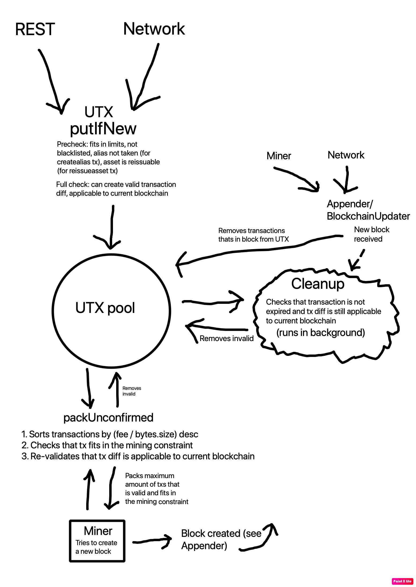

# Особенности обработки UTX

Транзакции в листе ожидания это ни разу не весело, они ведь хотят в блок! Как же определить какая транзакция должна первой попасть в блок. Можно было бы сделать простую очередь и руководствоваться принципом "Кто первый встал, того и тапки", но такой подход не является оптимальным для майнеров в сети. Им гораздо выгоднее класть в блок транзакции с большей комиссией. Но и тут не все так просто, вы ведь помните, что в Waves существует разные виды транзакций. У каждого вида своя минимальная комиссия, заданная в консенсусе, поэтому обработка в зависимости от размера комиссии тоже не приведет к ожидаемому результату. Например, отправка InvokeScript транзакций с минимальной комиссией в 0.005 Waves будет всегда попадать в блок раньше, чем транзакция Transfer с комиссией в 0.001 Waves. Что же делать?

Первое, что можно придумать, это сортировать транзакции в зависимости от стоимости на байт транзакции. Нода тратит ресурсы на валидацию подписи для транзакции, и чем больше транзакция по размеру, тем больше ресурсов на это потратится. Например, `Data` транзакция размером в 140 kb будет валидироваться в несколько десятков раз дольше, чем `Transfer` транзакция размером меньше килобайта. Давайте поговорим на примерах. Скажем, у нас есть 2 транзакции:

- Data транзакция размером в 100 kb и с комиссией в 0.01 Waves
- Transfer транзакция размером в 1kb и с комиссией в 0.001 Waves

Какая транзакция будет первой в очереди? Та, которая была получена первой, потому что в пересчете на 1 байт транзакции комиссия у этих 2 транзакций равная.

На схеме ниже показано, как именно нода обрабатывает транзакции до попадания в блок, а так же во время его нахождения там. На схеме вы можете видеть функцию `cleanup`, которая постоянно выполняется в фоне и проверяет, не стали ли транзакции, находящиеся в UTX, невалидными (истек срок жизни, баланс отправителя стал нулевым из-за другой транзакции и не может оплатить комиссию и т.д.) и нет ли необходимости их оттуда удалить.

