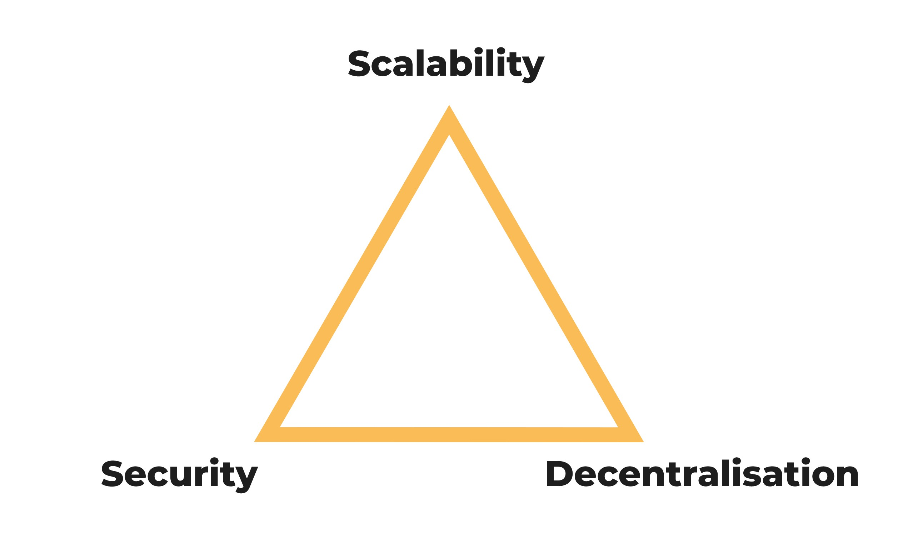

# Особенности смарт-контрактов в Waves

Смарт-контракты и децентрализованные приложения в Waves отличаются от таковых в Ethereum и многих других блокчейнах. Давайте рассмотрим основные отличия и их причины.

## Подсчет сложности

Все функции и операции в Ride, в том числе операции сложения, вычитания, деления, ветвления, а так же функции стандартной библиотеки имеют сложность. Сложность каждой операции выражается в условных единицах (назовем `complexity`, иначе придется называть `попугаи`). Например, операция сложения имеет complexity 1, а функция проверки подписи `sigVerify()` имееть complexity 200.

Так как в каждом скрипте есть много вариантов исполнения из-за ветвлений, то `complexity` скрипта считается как сложность самой сложной ветки. Если вы используете, например, online IDE, то он будет показывать сложность скрипта в режиме реального времени.

В Ride есть ограничение на максимальную сложность скрипта, и она разная для разных типов функций. Для функций `@Verifier`, смарт-аккаунтов и смарт-ассетов максимальная сложность скрипта составляет 3000 единиц, а для функций `@Callable` наиболее сложная ветка может иметь 4000 единиц. В отличие от других языков смарт-контрактов, например, Solidity в Ethereum, сложность скрипта всегда известна заранее, так как отсутствует Тьюринг-полнота. В случае Ethereum, довольно часто бывает, что мы используем цикл в коде, но не знаем сколько итераций будет в этом цикле в момент исполнения (код может читать коллекцию произвольной длины и итерировать по ней). Другой возможный в Ethereum сценарий - использование рекурсии. В Ride и Waves такое невозможно, так как отсутсвуют полноценные циклы - макрос `FOLD` заранее ограничивает максимальное количество исполнений, а рекурсий как таковых просто нет.

Заранее известная сложность избавляет от такой проблемы в Ethereum как `Out of gas`. Все, кто писал смарт-контракты и делал децентрализованные приложения на Solidity сталкивались с такой ситуацией, когда транзакция стала невалидной из-за того, что "закончился газ". В Waves такая ситуация попросту невозможна.

Кроме ограничения по максимальной сложности контракта, так же есть ограничение на максимальный размер контракта, на момент написания оно составляет 32 кб. То есть код децентрализованного приложения не может быть больше 32 кб.

## Отсутствие Тьюринг полноты

Ride является *не* Тьюринг полным языком, но не потому, что сделать Тьюринг полноту сложно или долго, а потому что у такого подхода есть свои плюсы. Блокчейн является не самой высокопроизводительной системой, ведь все транзакции выполняется на каждой ноде, а на сетевые коммуникации уходит большое количество ресурсов. Есть различные подходы к масштабированию, например, шардинг, создание сайдчейнов и тд, но все они являются копромиссами - при увеличении пропускной способности всегда страдает уровень децентрализации или безопасность. Именно это утверждает блокчейн трилемма. Из 3 характеристик блокчейн - децентрализации, скорости и безопасности, полностью обеспечить можно только 2. Или другими словами, необходимо выбирать одну грань у треугольника:

Как вы возможно помните, в ценностях Waves всегда быть максимально дружелюбной платформой для разработчиков и пользователей, поэтому скорость работы не должна быть узким местом, но в то же время блокчейн Waves не позволит делать десятки тысяч транзакций в секунду, так как блокчейн должен оставаться безопасным и децентрализованным. 

Отсутствие Тьюринг-полноты позволяет Waves предлагать оптимальное сочетание этих 3 характеристик:

1. Из-за отсутствия сложных скриптов, нода Waves может быть запущена на виртуальной машине за $40 в любом публичном облаке, что способствует децентрализации
2. Простота скриптов так же позволяет блокчейну иметь достаточную пропускную способность, чтобы даже при среднесуточном количестве транзакций в [100 000](http://dev.pywaves.org/txs/), не было конкуренции за попадание в блок и, соответственно, высоких комиссий.
3. Отсутствие Тьюринг-полноты делает смарт-контракты безопаснее. Ride является в какой-то мере DSL (domain specific language) или предметно-ориентированным языком, а не языком общего назначения, и именно DSL применяются в сферах, где требуется максимальная безопасность. Подробнее про это я рассказывал на одной из конференций в Сан-Франциско, с записью выступления вы можете ознакомиться [здесь](https://www.youtube.com/watch?v=gMcif_ADWak).

Таким образом, отсутствие Тьюринг-полноты несет в себе массу преимуществ, однако, это влияет на опыт разработки, давайте рассмотрим каким именно образом.

## Последствия отсутствия Тьюринг полноты

Отсуствие Тьюринг полноты иногда не позволяет реализовать весь необходимый функционал в рамках одной функции, поэтому часто в Waves приходится разбивать логику децентрализованного приложения на несколько функций и последовательно вызывать их с помощью нескольких `InvokeScript` транзакций. Например, одно из самых сложных приложений в сети Waves - стейблкоин [Neutrino](https://neutrino.at) состоит из 5 контрактов.

Контракты не могут напрямую вызывать друг друга (как в Ethereum), но они могут общаться друг с другом благодаря сохранению данных и промежуточных состояний в key-value хранилища. Любой контракт может читать хранилище любого другого контракта или аккаунта, поэтому логика обработки сложных вычислений часто представляет из себя следующее:

1. Функция 1 децентрализованного приложения A вызывается с помощью `InvokeScript` транзакции, результат выполнения записывается в хранилище аккаунта A.
2. Функция 1 децентрализованного приложения B, вызванная с помощью `InvokeScript` транзакции, читает данные, записыванные в хранилище приложения А и использует для вычисления своего результата.

Возможность чтения состояния хранилища другого аккаунта в Waves является мощнейшим инструментом, позволяющим композировать логику, строить приложения, которые опираются на другие, уже существующие.

## Особенности обработки UTX

В разделе 5 мы разбирали как именно происходит сортировка транзакций в UTX пуле, однако в тот момент мы опустили некоторые детали. Сейчас, когда вы знакомы с концепцией сложности скрипта, давайте разберемся во всех деталях.

Как мы уже говорили, сортировка транзакций в очереди на попадание в блок происходит по размеру комисси на 1 байт транзакции, однако есть и второй параметр, который необходимо учитывать - сложность исполнения скрипта. Задача майнера в том, чтобы максимизировать прибыль, получаемую с комиссий, поэтому майнеру может быть не выгодно валидировать транзакции со скриптом и тратить на них драгоценное время, когда можно положить в блок много транзакций без скрипта, просто проверив подпись. В данный момент `complexity` никак не учитывается при сортироке транзакций в UTX, однако, в дальнейшем такой параметр обязательно должен появиться.

В блокчейне Waves есть несколько параметров, которые ограничивают размеры блока, то есть, косвенно ограничивают максимальную пропускную способность:

- до 1 мегабайта транзакций в блоке (около 6000 транзакций)
- ограничение на максимальную суммарную сложность скриптов в блоке равна 1 000 000 (не более 250 транзакций вызова скрипта с максимальной сложностью). При достижении этого лимита в блок будут укладываться только транзакции, не связанные с исполнением скриптов, и ровно до тех пор, пока не будет достигнут лимит по размеру в 1 мегабайт.

Важно понимать, что эти параметры могут быть пересмотрены в будущем, если это будет необходимо для обслуживания всех пользователей. Однако это приведет к возрастанию системных требований к нодам.
