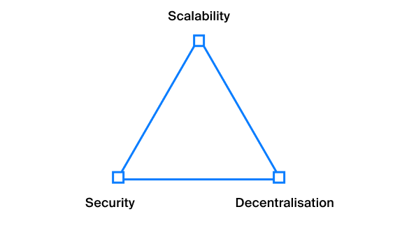

# Language runtime Ride

Smart contracts and decentralized applications in Waves are different from those in Ethereum and many other blockchains. Let's take a look at the main differences and their reasons.

## Calculating difficulty

All functions and operations in Ride, including operations of addition, subtraction, division, branching, as well as functions of the standard library have complexity. The complexity of each operation is expressed in arbitrary units (let's call it `complexity`, otherwise we will have to call it` parrots`). For example, the addition operation has a complexity of 1, and the signature verification function `sigVerify ()` has a complexity of 200.

Since each script has many execution options due to branches, the `complexity` of a script is considered the complexity of the most complex branch. If you use, for example, an online IDE, then it will show the complexity of the script in real time.

Ride has a limit on the maximum complexity of the script, and it is different for different types of functions. For `@ Verifier` functions, smart accounts and smart assets, the maximum script complexity is 3000 units, and for` @ Callable` functions, the most complex branch can have 4000 units. Unlike other smart contract languages, such as Ethereum's Solidity, the complexity of a script in Ride is always known in advance, since there is no Turing completeness. In the case of Ethereum, it quite often happens that we use a loop in the code, but do not know how many iterations this loop will have at the time of execution (the code can read a collection of arbitrary length and iterate over it). Another possible scenario in Ethereum is the use of recursion. In Ride and Waves, this is impossible, since there are no full-fledged loops - the `FOLD` macro limits the maximum number of executions in advance, and there are simply no recursions as such.

The well-known complexity eliminates Ethereum's `Out of gas` problem. Everyone who wrote smart contracts and made decentralized applications on Solidity faced such a situation when the transaction became invalid due to the "out of gas". In Waves, this situation is simply impossible.

In addition to the limitation on the maximum complexity of the contract, there is also a limitation on the maximum contract size, at the time of writing it is 32 kb. That is, the code of a decentralized application cannot be more than 32 kb.

## Lack of Turing completeness

Ride is * not * Turing complete, not because it is difficult or time-consuming to make Turing complete, but because this approach has its advantages. The blockchain is not the most high-performing system, because all transactions are performed on each node, and a large amount of resources are spent on network communications. There are various approaches to scaling, for example, sharding, creating sidechains, etc., but they are all compromises - when the bandwidth increases, the level of decentralization or security always suffers. This is exactly what the blockchain trilemma claims. Of the 3 characteristics of the blockchain - decentralization, speed and security, only 2 can be fully ensured. Or in other words, you need to choose one side of the triangle:

As you may remember, Waves values ​​always be the most friendly platform for developers and users, so the speed of work should not be a bottleneck, but at the same time, the Waves blockchain will not allow tens of thousands of transactions per second, since the blockchain must remain secure and decentralized.

The lack of Turing completeness allows Waves to offer the optimal combination of these 3 characteristics:

1. Due to the lack of complex scripts, the Waves node can be run on a virtual machine for $ 40 in any public cloud, which contributes to decentralization
2. The simplicity of scripts also allows the blockchain to have sufficient bandwidth so that even with an average daily number of transactions of [100,000](http://dev.pywaves.org/txs/), there is no competition for getting into the block and, accordingly, high commissions.
3. Lack of Turing completeness makes smart contracts safer. Ride is to some extent a DSL (domain specific language) or domain-specific language, not a general-purpose language, and DSLs are used in areas where maximum security is required. I talked about this in more detail at one of the conferences in San Francisco, you can see the recording of the speech [here](https://www.youtube.com/watch?v=gMcif_ADWak).

Thus, the lack of Turing completeness carries a lot of advantages, however, it affects the development experience, let's look at exactly how.

## Consequences of Lack of Turing Completeness

The lack of Turing completeness sometimes does not allow implementing all the necessary functionality within one function, so often in Waves you have to split the logic of a decentralized application into several functions and call them sequentially using several `InvokeScript` transactions. For example, one of the most complex applications on the Waves network - stablecoin [Neutrino](https://neutrino.at) consists of 5 contracts.

Contracts cannot call each other directly (as in Ethereum), but they can communicate with each other by storing data and intermediate states in the key-value store. Any contract can read the storage of any other contract or account, so the logic for processing complex computations is often the following:

1. Function 1 of decentralized application A is called using the `InvokeScript` transaction, the result of execution is written to the storage of account A.
2. Function 1 of decentralized application B, called with the `InvokeScript` transaction, reads the data written to the storage of application A and uses it to calculate its result.

The ability to read the storage state of another account in Waves is a powerful tool that allows you to compose logic, build applications that rely on other existing ones.

## UTX Processing Features

In Section 5, we discussed how transactions are sorted in the UTX pool, but at that moment we omitted some details. Now that you are familiar with the concept of script complexity, let's go into all the details.

As we have already said, the sorting of transactions in the queue for hitting the block occurs according to the size of the commission per 1 byte of the transaction, but there is a second parameter that must be taken into account - the complexity of the script execution. The miner's task is to maximize the profit received from commissions, so it may not be profitable for the miner to validate transactions with a script and waste precious time on them, when you can put many transactions in a block without a script, just by checking the signature. At the moment, `complexity` is not taken into account in any way when sorting transactions in UTX, however, in the future, such a parameter must appear.

There are several parameters in the Waves blockchain that limit block sizes, that is, indirectly limit the maximum bandwidth:

- up to 1 megabyte of transactions in a block (about 6000 transactions)
- the limitation on the maximum total complexity of scripts in a block is 1,000,000 (no more than 250 script call transactions with maximum complexity). When this limit is reached, only transactions that are not related to the execution of scripts will fit into the block, and exactly until the size limit of 1 megabyte is reached.

It is important to understand that these parameters may be revised in the future if necessary to serve all users. However, this will lead to an increase in system requirements for nodes.

## Transactions with errors

Execution of scripts when sending transactions (smart asset, smart account or decentralized application) can be successful or fail. If the script ends with an error or the result is `false` for smart accounts and smart assets, scenarios are possible when the transaction enters the blockchain and the commission is debited from the sender, but the opposite is also possible. Let's take a look at the peculiarities of transactions with errors.

Scripts for decentralized applications and smart assets are not executed when they are added to UTX, but are executed only when they are added to the block. Therefore, such scripts, ending with an exception, will enter the blockchain if they successfully hit UTX. In other words, the transaction will not complete successfully, but the sender will still pay the fee. The Waves node API has a special POST `/ debug / validate` method that helps pre-check transactions to minimize potential financial losses.

Thus, adding a transaction to the blockchain does not guarantee that it has completed and performed any actions. You can check the status of the script call using the REST API node, which, when requesting a transaction by ID, returns the `applicationStatus` field.

Scripts executed for smart accounts and the `@ Verifier` functions work differently - they are validated at the moment of adding to UTX, and even if they returned an error at the time of adding to the block, the transaction will not fall into the block and the sender will not pay the commission.

## Number of executable scripts

Many Waves app developers do not fully understand the load on the blockchain their apps can create. Let's count how many scripts can be executed when sending one `InvokeScript` transaction (in the order in which it actually happens):

- Asset scripts that are attached as `payment` to the call - up to 2
- Script of the most decentralized application - 1
- Script on the account that calls the application function - 1
- Asset scripts that are translated as a result of calling an application function - up to 10

> It turns out that one call to the application function can lead to the execution of 14 scripts, each of which can have a complexity of 4000 units.

A similar situation occurs when sending an `Exchange` transaction, where 2 scripts of the accounts of order senders, 2 scripts of assets, 2 scripts of assets in the commission, 1 script on the matcher's account can be executed, up to 7 scripts in total.