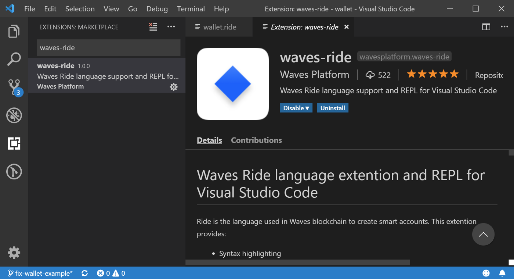
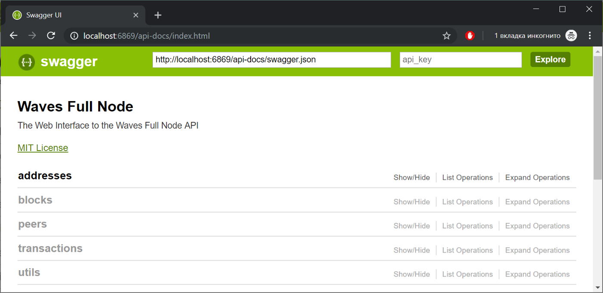
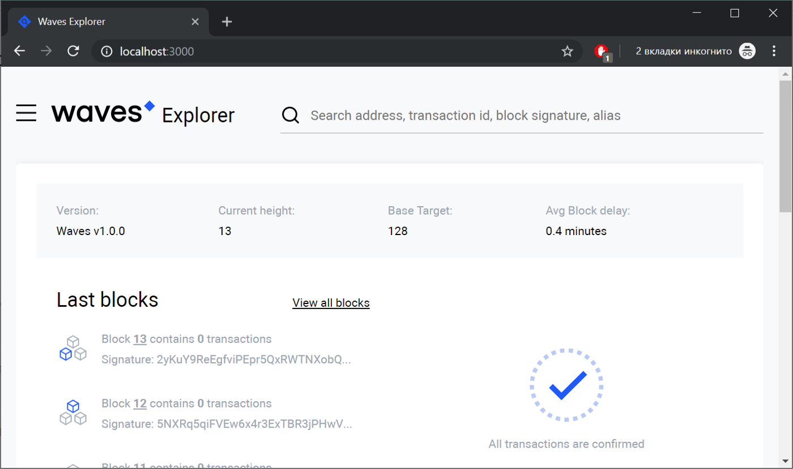
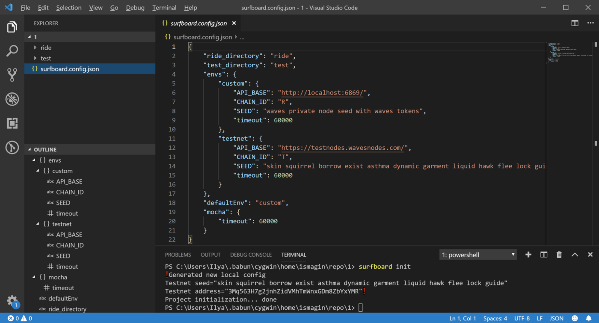
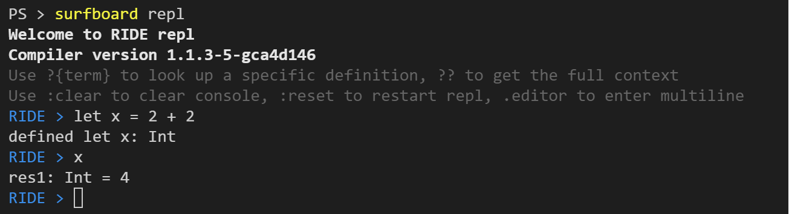
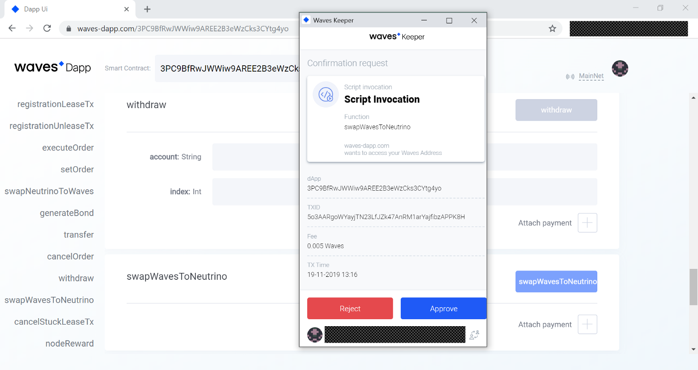

# Инструменты для разработки децентрализованных приложений

Для удобства разработки децентрализованных приложений на Waves существует большое количество разных инструментов. Начать стоит, в первую очередь, с обозревателя блокчейна, который расположен по адресу [wavesexplorer.com](https://wavesexplorer.com) и позволяет анализировать данные в блоках, все транзакции и UTX как в основной сети, так и в stagenet и testnet.

Однако, если мы говорим про разработку децентрализованных приложений, а не просто использование, то встает несколько основных вопросов:

1. В какой среде писать код для смарт-аккаунтов, смарт-ассетов и децентрализованных приложений?
2. Как тестировать написанный код? Какие есть варианты для автоматического тестирования и ручного?
3. Как отлаживать код?
4. Как деплоить?

Давайте разберем по порядку какие есть инструменты для этого.

## Среда разработки

Самым простым вариантом начать писать код, тестировать и работать с аккаунтами, является использование онлайн IDE, который доступен по адресу [https://ide.wavesplatform.com](https://ide.wavesplatform.com/). В нем есть подсветка синтаксиса Ride, умные подсказки, вывод типов, компилятор, консоль для работы с библиотекой `waves-transactions` и даже REPL (read-eval-print loop) Ride, который позволяет выражения на Ride исполнять прямо в браузере. Так же есть примеры кода на Ride, примеры интеграционных тестов на JavaScript, возможность управления аккаунтами и отправки транзакций с помощью веб-интерфейса. Онлайн IDE отлично подходит для тестирования контрактов в stagenet и testnet. Токены Waves для этих сетей можно бесплатно получить с помощью крана в wavesexplorer по адресам `https://wavesexplorer.com/stagenet/faucet` и `https://wavesexplorer.com/testnet/faucet`, но не более 10 Waves каждые 10 минут.

Однако, для более профессиональной разработки контрактов, рекомендую использовать другие инструменты.

Расширение [RIDE для Visual Studio Code](https://marketplace.visualstudio.com/items?itemName=wavesplatform.waves-ride) является первым необходимым инструментом для профессиональной разработки с использованием блокчейна Waves. Установка этого расширения позволяет получить подсветку синтаксиса и подсказки для файлов с расширением `.ride`.




Кроме подсветски синтаксиса, расширение добавлеяет в VS Сode еще и интерактивную консоль (прямо как в онлайн IDE), которая позволяет запускать функции из `waves-transactions`, `waves-crypto` и еще несколько специализированных.


## Локальное окружение

Во время разработки можно взаимодействовать с нодами из stagenet или testnet, которые доступны по адресам `http://nodes-stagenet.wavesnodes.com/` и `https://nodes-testnet.wavesnodes.com/`, однако наиболее удобным вариантом является использование приватного блокчейна из одной единственной ноды. 
Запустить такой блокчейн можно при условии наличия установленного Docker. Запуск осуществляется простой командой:

```bash
docker run -d -p 6869:6869 wavesplatform/waves-private-node
```

После запуска команды, локальный блокчейн будет запущен в виде Docker контейнера, API ноды будет доступен по адресу `http://localhost:6869/`, а все 100 миллионов токенов будут на балансе аккаунта с сид фразой `waves private node seed with waves tokens`.



Подробную информацию о Docker образе с этой нодой вы можете найти в [этом репозитории](https://github.com/wavesplatform/private-node-docker-image).

Преимуществами такого подхода являются:

- Уменьшенное время блока: в testnet и stagenet блоки генерируются раз в минуту, тогда как в вашей приватной сети будут каждые 10 секунд. Это позволяет экономить время во время прогонов интеграционных тестов.
- Контроль над всеми токенами и отсутствие необходимости запрашивать токены с использованием крана
- Полный контроль над домой и работоспособностью API. Команда Waves Protocol старается обеспечить максимальную доступность публичных узлов, однако не всегда это возможно и в некоторых случаях API для stagenet или testnet могут быть недоступны.
- Ответы API публичных нод кэшируются, что может вызывать неожиданные ошибки.

После запуска ноды вы так же можете запустить локальный обозревательно блокчейна, который будет работать с вашей нодой. Делается это так же с помощью разворачивания Docker образа:

```bash
docker run -d -e API_NODE_URL=http://localhost:6869 -e NODE_LIST=http://localhost:6869 -p 3000:8080 wavesplatform/explorer
```

Обратите внимание, что при разворачивании указывается адрес API нашей ноды с приватным блокчейном.

После разворачивания образа, обозревательно станет доступен по адресу `http://localhost:3000`:



## Тестирование кода

На момент написания этих строк существует возможность написания только интеграционных тестов для децентрализованных приложений на Ride. Инструментов для Unit тестов пока нет. Интеграционное тестирование в случае с Ride подразумевает, что написанный код компилируется, разворачивается с помощью `SetScript`, `SetAssetScript` или `Issue` транзакции на ассете или аккаунте и выполняются транзакции, которые проверяют корректность поведения скрипта. Другими словами, идет непосредственно работа с блокчейном (не эмуляцией!) и отправляются настоящие транзакции.

Интеграционные тесты могут быть написаны на Java с использованием библиотеки [Paddle](https://github.com/msmolyakov/paddle) или на [JavaScript] с использованием онлайн IDE или библиотеки `surfboard`.

Surfboard можно установить из npm (при условии наличия у вас node.js и npm) слдующей командой:

```bash
npm install -g @waves/surfboard
```

После этого у вас станет доступна команда `surfboard`. Команда `surfboard init` позволит инициализировать новый проект, который будет содержать конфигурационный файл и директории для тестов (`./test`) и скриптов на Ride (`./ride`). Конфигурационный файл позволяет задать настройки для работы с разными типами сетей, параметры аккаунтов и т.д.



В директории `./test` можно создавать любые файлы с расширением `.js` и писать в них интеграционные тесты с использованием тестового фреймворка `Mocha`. Кроме непосредственно самой `Mocha` в тестовом файле доступны функции из `waves-transactions` и несколько дополнительных функций и переменных:

- `setupAccounts({[key: string]: number})` - позволяет в начале скрипта создать новые аккаунты и перечислить на них с мастер сида тоокена
- `compile(file: File): String` - позволяет скомпилировать содержимое файла
- `file(path: String): File` - позволяет получить содержимое файла
- `accounts` - объект, в которой хранятся сиды созданных функцией `setupAccounts` аккаунтов

Описание этих и других функций доступно [в документации](https://wavesplatform.github.io/js-test-env/globals.html). Примеры тестов вы можете найти в онлайн IDE или в репозитории [ride-examples](https://github.com/wavesplatform/ride-examples).

Запуск тестов в директории можно запустить с помощью команды `surfboard test`, если же хочется запустить конкретный файл, а не все файлы в директории `./test`, то можно выполнить `surfboard test my-scenario.js`.

## Отладка скриптов Ride

Для отладки скриптов Ride принято искользовать 2 основных приема.

В онлайн IDE и Surfboard есть REPL, который позволяет ввести код и срзу же получить результат. REPL позволяет не только выполнять базовые операции, но и объявлять переменные, работать с настоящим блокчейном (например, читать стейт аккаунтов), вызывать функции стандартной библиотеки



В более сложных ситуациях, когда у вас уже есть полноценный скрипт, который необходимо отлаживать, на помощь приходит функция `throw()` из стандартной библиотеки Ride, которая позволяет выбросить ошибку и текстовое описание к ней.

## Ручное тестирование приложений

Если вам по душе больше ручное тестирование или вы хотите поиграться с приложениями, уже развернутыми в сети, вы можете воспользоваться веб-сайтом [https://waves-dapp.com](https://waves-dapp.com/). Вы можете просто указать адрес аккаунта нужного децентрализованного приложения и Waves-Dapp покажет все доступные функции, какие параметры они принимают и позволит вызвать любую из них. Инструмент может быть полезен и для тестирования своего приложения, когда у вас нет интерфейса или тестов для некоторых функций, или, вам необходимо поменять настройки вашего приложения.


