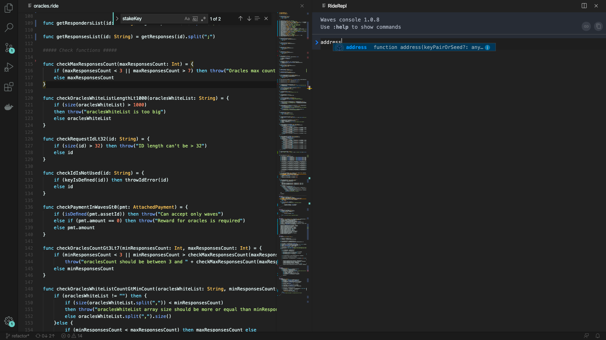

# Инструменты для разработки децентрализованных приложений

Для удобства разработки децентрализованных приложений на Waves существует большое количество разных инструментов. Начать стоит, в первую очередь, с обозревателя блокчейна, который расположен по адресу [wavesexplorer.com](https://wavesexplorer.com) и позволяет анализировать данные в блоках, все транзакции и UTX как в основной сети, так и в stagenet и testnet.

Однако, если мы говорим про разработку децентрализованных приложений, а не просто использование, то встает несколько основных вопросов:

1. В какой среде писать код для смарт-аккаунтов, смарт-ассетов и децентрализованных приложений?
2. Как тестировать написанный код? Какие есть варианты для автоматического тестирования и ручного?
3. Как отлаживать код?
4. Как деплоить?

Давайте разберем по порядку какие есть инструменты для этого.

## Среда разработки

Самым простым вариантом начать писать код, тестировать и работать с аккаунтами, является использование онлайн IDE, который доступен по адресу [https://ide.wavesplatform.com](https://ide.wavesplatform.com/). В нем есть подсветка синтаксиса Ride, умные подсказки, вывод типов, компилятор, консоль для работы с библиотекой `waves-transactions` и даже REPL (read-eval-print loop) Ride, который позволяет выражения на Ride исполнять прямо в браузере. Так же есть примеры кода на Ride, примеры интеграционных тестов на JavaScript, возможность управления аккаунтами и отправки транзакций с помощью веб-интерфейса. Онлайн IDE отлично подходит для тестирования контрактов в stagenet и testnet. Токены Waves для этих сетей можно бесплатно получить с помощью крана в wavesexplorer по адресам `https://wavesexplorer.com/stagenet/faucet` и `https://wavesexplorer.com/testnet/faucet`.

Однако, для более профессиональной разработки контрактов, рекомендую использовать другие инструменты.

Расширение [RIDE для Visual Studio Code](https://marketplace.visualstudio.com/items?itemName=wavesplatform.waves-ride) является первым необходимым инструментом для профессиональной разработки с использованием блокчейна Waves. Установка этого расширения позволяет получить подсветку синтаксиса и подсказки для файлов с расширением `.ride`. Кроме подсветски синтаксиса, расширение добавлеяет в VS Сode еще и интерактивную консоль (прямо как в онлайн IDE), которая позволяет запускать функции из `waves-transactions`, `waves-crypto` и еще несколько специализированных.

## Локальное окружение

Во время разработки можно взаимодействовать с нодами из stagenet или testnet, которые доступны по адресам `http://nodes-stagenet.wavesnodes.com/` и `https://nodes-testnet.wavesnodes.com/`, однако наиболее удобным вариантом является использование приватного блокчейна из одной единственной ноды. 