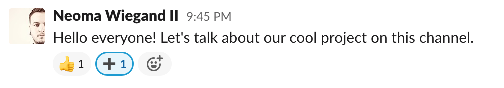

# Billy

Лучший способ выучить язык - начать на нем писать. Заставить вас писать я не могу, поэтому предложу вам второй по крутизне вариант - читать как пишется код! Мы разберем несколько примеров контрактов, начнем с относительно простых, и закончим на достаточно сложных и разухабистых. Первым контрактом, который будем писать является контракт Oraculus, его идея очень проста - сделать децентрализованных оракулов.

## Описание проекта

Billy - децентрализованное приложение на базе бота для корпоративного мессенджера Slack. Вы можете найти подробную информацию о том, как работает Billy, на официальном сайте проекта - [https://iambilly.app](https://iambilly.app). Но давайте я коротко расскажу о том из каких частей он состоит и как именно в нем используется блокчейн.

Billy является проектом для мотивации сотрудников компании. В ходе работы у нас возникает много ситуаций, когда мы помогаем коллегам или они помогают нам. И далеко не всегда такая помощь входит в рабочие обязанности коллеги. Чтобы стимулировать помощь вы можете добавить Billy в Slack одной кнопкой на официальном сайте проекта. Billy генерирует уникальный адрес для каждого сотрудника компании и сохраняет их в базе данных. Каждый месяц бот начисляет на сгенерированные адреса 500 "Спасибо"-токенов, которые могут быть потрачены с помощью этого бота. Для этого сотрудники компании могут отправлять специальные команды боту (`10 спасибо @username`) или реагировать на сообщения с использованием специальных emoji.



Неиспользованный остаток из 500 спасибо-токенов за месяц сгорают в конце этого месяца. Заработанные спасибо-токены не сгорают и могут быть использованы для 3 целей:

- **Перевод другим пользователям в благодарность.** Полученные токены можно переводить в любое время своим коллегам.
- **Покупка товаров во внутреннем магазине.** Внутренний магазин позволяет сотрудникам компании (или уполномоченным лицам) предлагать товары и услуги в обмен на спасибо-токены.
- **Для участия в голосованиях и crowdfunding компаниях.** Каждый пользователь может указать цель, для которой собирает токены (например, проведение внутренного митапа) или руководство компании может инициировать голосования, где каждый токен будет считаться одним голосом, то есть более "полезный" и активный сотрудник может больше влиять на итоги голосования.

Видео-демонстрацию работы бота вы можете найти на официальном сайте проекта - [https://iambilly.app](https://iambilly.app). Система максимально скрывает для пользователей все, что касается блокчейна. При необходимости пользователь может запросить свою `seed` фразу и использовать токены вне Slack, однако по умолчанию все детали реализации для него скрыты, чтобы не создавать лишних барьеров.

## Реализация

Преждем чем перейти к реализации идеи, давайте опишем все требования к сущностям в блокчейне в более формальном виде:

1. Для каждой команды в Slack выпускается уникальный токен, который будет является внутренней валютой команды
2. Для каждого участника команды создается отдельный аккаунт, на котором хранятся только токены этой команды
3. Токены команды могут переводиться только между членами команды, поэтому список адресов членов команды нам необходимо где-то хранить
4. Любой член команды может сжечь свои токены
5. Покупка товара в магазине или участие в голосовании осуществляется через вызовы функций децентрализованного приложения с приложенными токенами команды
6. За каждую покупку в магазине, пользователь получает уникальный NFT токен, который подтверждает покупку

Система является комплексной и должна включать в себя несколько скриптов. Первый логичной шаг - выпуск токена для команды, является достаточной простой операцией отправки `Issue` транзакции (мы рассматривали пример в главе 5). Мы не хотим, чтобы пользователи системы должны были оплачивать комиссии за переводы в Waves и покупать для этого Waves, поэтому мы используем функционал спонсирования. Это позволит пользователям платить за транзакции в токенах "Спасибо", в то время как настоящие Waves комиссии будут списываться с аккаунта администратора команды.

```js
    const adminSeed = '...';
    const issueTx = issue({
        name: `Thanks`,
        description: 'Say thank you to all of your teammates in Slack. By Billy.',
        decimals: 0,
        quantity: 100000000,
        reissuable: false
    }, adminSeed);

    await broadcast(issueTx);
    await waitForTx(issueTx.id);
    const sponsorshipTx = sponsorship({
        assetId: issueTx.id,
        minSponsoredAssetFee: 1
    }, adminSeed);
    await broadcast(sponsorshipTx);
```

Мы используем функцию `waitForTx` из библиотеки `waves-transactions`, чтобы убедиться, что транзакция выпуска токена попала в блокчейн и только потом отправить транзакцию спонсирования.

Использование спонсирования некоторым образом ограничивает наши возможности по остальным требованиям, так как спонсирование не может быть использовано вместе со смарт-ассетами. То есть, на уровне токена мы не можем заложить ограничение на перевод токенов только другим членам команды. В дальнейшем, с реализацией [WEP-2 Customizable sponsorship](https://forum.wavesplatform.com/t/wep-2-customizable-sponsorship/15880) станет возможно включать спонсирование для смарт-ассетов, но в данный момент мы можем найти и другое решение. Например, мы можем на аккаунт каждого члена команды поставить скрипт (и сделать смарт-аккаунт), который будет проверять есть ли получатель токенов в списке коллег и позволять или запрещать транзакцию.

Список адресов членов команды необходимо так же хранить где-то в блокчейне. Так как у нас будет децентрализованное приложение для совершения покупок и голосования, мы туда же можем добавить функционал управления списком членов команды. Давайте сделаем децентрализованное приложение, которое позволяет добавить или удалить человека из списка. Функция добавления в список будет принимать адрес в качесте аргумента и добавлять в хранилище пару ключ-значение, где ключом будет адрес, а значением - `true`. Функция удаления будет обновлять запись в хранилище и переводить значение для указанного адреса в `false`.

```scala

{-# STDLIB_VERSION 4 #-}
{-# CONTENT_TYPE DAPP #-}
{-# SCRIPT_TYPE ACCOUNT #-}

let adminPublicKey = base58'...'

func addToWhiteList(address: String) = {
    let userInTheList = getBoolean(this, address)
    let newValue = match userInTheList {
        case b: Boolean => {
            if b then throw("User is already in the list and enabled")
            else true
        }
        case _ => true
    }
    if i.callerPublicKey != adminPublicKey then throw("Only admin can call this function") else
    [
        [BooleanEntry(address, newValue)]
    ]
}

@Callable(i)
func removeFromWhiteList(address: String) = {
    if i.callerPublicKey != adminPublicKey then throw("Only admin can call this function")
    else [BooleanEntry(address, false)]
}
```

Давайте напишем код смарт-аккаунта, который будет устанавливаться для каждого члена команды:

```scala
{-# STDLIB_VERSION 4 #-}
{-# CONTENT_TYPE EXPRESSION #-}
{-# SCRIPT_TYPE ACCOUNT #-}

# указываем id токена, который мы выпустили для данной команды
let assetId = base58'...'
# адрес аккаунта, на котором будет децентрализованное приложение и список аккаунтов членов команды
let whiteListAddress = "..."

match tx {
    # Любой член команды может сжечь свои токены
    case b: BurnTransaction => {
        sigVerify(tx.bodyBytes, tx.proofs[0], tx.senderPublicKey)
    }

    # Обновление этого скрипта возможно при наличии 2 подписей - члена команды
    # и администратора команды, с аккаунта которого выпускается токен для команды
    case s: SetScriptTransaction => {
        let assetIssuerPublicKey = assetInfo(assetId).extract().issuerPublicKey
        sigVerify(tx.bodyBytes, tx.proofs[0], tx.senderPublicKey) &&
        sigVerify(tx.bodyBytes, tx.proofs[1], assetIssuerPublicKey)
    }

    # Токены команды могут переводиться только между членами команды, другие токены могут
    # переводиться при наличии подписи аккаунта
    case t: TransferTransaction => {
        # Если переводимый токен НЕ токен команды, то проверяем подпись
        if t.assetId != assetId then sigVerify(t.bodyBytes, t.proofs[0], t.senderPublicKey) else
        {
            # получаем адрес получателя токенов в виде строки
            let recipientAddress = addressFromRecipient(t.recipient).toString()

            # переводим адрес децентрализованного приложения команды в тип Address
            let whiteListAddressValue = addressFromStringValue(whiteListAddress)

            # читаем значение из хранилища децентрализованного приложения команды по ключу
            # равному текстовому представлению адреса получателя текущей транзакции
            let addressIsAllowed = getBoolean(whiteListAddressValue, recipientAddress)

            # проверяем, что полученное из хранилища значение == true
            # иначе (если false или Unit) то записываем false в переменную
            let addressInWhiteList = match addressIsAllowed {
                case b: Boolean => b == true
                case _ => false
            }

            # если адрес получателя есть в списке сотрудников
            # или токены переводятся на децентрализованное приложение команды, то
            # проверяем подпись транзакции (должна быть подписана ключом аккаунта)
            if ((addressInWhiteList || recipientAddress == whiteListAddress)) then {
                if (sigVerify(tx.bodyBytes, tx.proofs[0], tx.senderPublicKey))
                then true
                 else
                throw("Signature is required")
            }else {
                throw("You can send this token only to white-listed addresses")
            }
        }
    }

    # Если вызывается функция децентрализованного приложения
    # то позволяем вызывать только приложение команды
    case i: InvokeScriptTransaction => {
        # получаем адрес вызываемого приложения в виде строки
        let dappCalledAddress = addressFromRecipient(i.dApp).toString()

        # если адрес вызываемого приложения равен адресу приложения команды, то 
        # требуем подпись пользователя
        # иначе запрещаем вызов
        if (dappCalledAddress != whiteListAddress) then throw("You can call only dApp with address " + whiteListAddress + ", but you're trying to call " + dappCalledAddress) else
        if (sigVerify(tx.bodyBytes, tx.proofs[0], tx.senderPublicKey) == false) then throw("Transaction should be signed with users key") else
        true
    }

    # Запрещаем все остальные типы транзакций, в том числе обмен, выпуск токена и т.д.
    case _ => throw("Bad transaction type")
}

```

Описанные выше скрипты позволят удовлетворить следующие требования:

1. Для каждой команды в Slack выпускается уникальный токен, который будет является внутренней валютой команды
2. Для каждого участника команды создается отдельный аккаунт, на котором хранятся токены этой команды
3. Токены команды могут переводиться только между членами команды, поэтому список адресов членов команды нам необходимо где-то хранить
4. Любой член команды может сжечь свои токены

Однако, есть еще 2 требования, которые нам необходимо выполнить:

1. Покупка товара в магазине или участие в голосовании осуществляется через вызовы функций децентрализованного приложения с приложенными токенами команды
2. За каждую покупку в магазине, пользователь получает уникальный NFT токен, который подтверждает покупку

