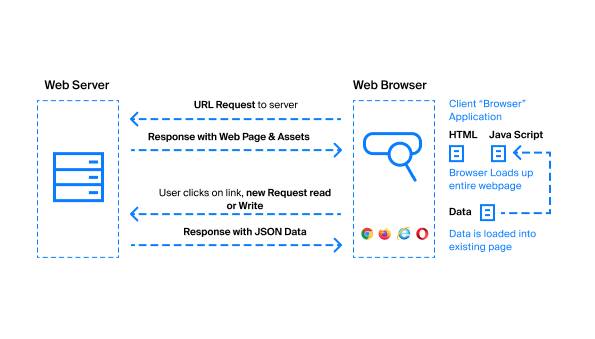
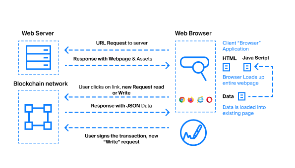

# User interactions

In all the examples before, we considered either static seed phrases right in the code, or generated seed phrases for users, but in real Web3 application development we often need to interact with the user to get a signature. At the same time, we cannot request a seed phrase or a private key from him, since this is completely unsafe. Having a private key or a user's seed phrase, you can do any action with his account, so decentralized applications request a signature for each specific action.

Let's compare the logic of a regular application and a Web3 application to better understand the difference in logic. Let's start with a regular web application, the logic of which boils down to the following steps:

1. The web browser requests a certain URL
2. The web server sends HTML, CSS, JavaScript and data as a response
3. The user sees the rendered page with data
4. The user takes any action (clicks on buttons, submitting forms), after which the application logic (JavaScript) makes XHR (AJAX) requests to the server
5. The web server responds with a new batch of HTML, CSS, JavaScript and data



The logic of the Web3 application is different:

1. The web browser requests a certain URL
2. The web server sends HTML, CSS, JavaScript and data as a response
3. JavaScript code requests additional data from the blockchain node
4. The user sees the rendered page with data
5. The user takes any read actions (clicks on buttons, submitting forms), after which the application logic (JavaScript) makes XHR (AJAX) requests to the server ** and / or to the blockchain node **
6. The web server responds with a new batch of HTML, CSS, JavaScript and data
7. For cases ** recording and updating data **, before sending a request to a blockchain node, the client code in JavaScript ** requests a user signature **



There are several ways to work with user keys, and the most common is using browser extensions. The Waves ecosystem has adopted the Waves Keeper extension, which stores seed phrases and allows signing user actions.

## Waves Keeper

Waves Keeper allows users to manage their accounts:

1. Create new accounts with a random seed phrase or add already created ones
2. Display the balances of the Waves token on each account
3. Sign transactions and other data
4. Work with different networks (mainnet, stagenet, testnet or private).

Waves Keeper is available for Google Chrome, Firefox, Edge, Opera, Brave users. You can find download links [on the product page on the protocol website](https://wavesprotocol.org/protocol/keeper).

Unlike extensions for other protocols, for example, Metamask for Ethereum, Waves Keeper is not a full-fledged wallet, since it does not allow you to view transaction history or create a transaction (only sign it).

<div style = "text-align: center">


</div>

> Waves Keeper - a secure way to manage keys and interact with decentralized apps

Seed phrases in Waves Keeper are stored in the local storage of the extension, encrypted with a password, and are not available for websites. They have access to the `WavesKeeper` object in the global scope, which provides an API for working with keys. Let's take a look at the basic techniques that can be helpful when integrating Waves Keeper into your user interface.

The WavesKeeper object contains the following methods:

``` js
WavesKeeper = {
  auth: function () {},
  publicState: function () {},
  signAndPublishCancelOrder: function () {},
  signAndPublishOrder: function () {},
  signAndPublishTransaction: function () {},
  signCancelOrder: function () {},
  signOrder: function () {},
  signTransaction: function () {},
  signRequest: function () {},
  signTransactionPackage: function () {},
  signCustomData: function () {},
  verifyCustomData: function () {},
  notification: function () {},
  encryptMessage: function () {},
  decryptMessage: function () {},
  resourceIsApproved: function () {},
  resourceIsBlocked: function () {},
  on: function () {}
}
```

Most of the methods are asynchronous and return `Promise`. Examples of using some of the methods are available on the demo page [in my Github repository](https://kardanovir.github.io/WavesKeeper/).

The auth method is one of the most commonly used and allows you to ask the user for information about his account, which is active at the time of the call. The `auth` function needs to be passed information about the application and data for signing. Waves Keeper will return us not only account information, but also signed data from the `data` field, which will allow us to validate the signature in our application code and make sure that the user has an account key with the specified public key and address, and he does not try to break our logic, for example, replacing the global `WavesKeeper` object.

``` js
WavesKeeper.auth ({name: 'MyApp', data: 'Custom data to Sign', icon: 'https://docs.wavesplatform.com/_theme/brand-logo/waves-docs-logo.png'})
  .then (function (res) {
    // res will contain information about the account
  })
  .catch (function (err) {console.log (err)});

```

After calling the method, a `Promise` will be returned, which will resolve successfully if the user gives permission to grant access, or will fail if access is denied.

The `res` variable will contain an object:

``` json
{
    "data": "Custom data to Sign",
    "prefix": "WavesWalletAuthentication",
    "host": "localhost",
    "name": "MyApp",
    "icon": "https://docs.wavesplatform.com/_theme/brand-logo/waves-docs-logo.png",
    "timestamp": 1543175910353,
    "address": "3PKqkMWvjjwjqbVSu8eL48dNfzWc3ifaaWi",
    "publicKey": "4WLcUznGiQXCoy2TnCohGKzDR8c14LFUGezvLNu7CVPA",
    "signature": "4s2nz8RxT29UwbJoNjPWxYwjsXYeoaMWK4dDM5eQN5gRmeZWGrN1HbpsirhTzWMJFAGtzzw4U78RNRKeEtwficwR"
}
```

Keeper returns the public account key, prefix and signature along with the account address. To finally make sure that the user has this account, it is necessary to check the signature from the `prefix + data` for this public key and make sure that this public key is converted to such an address.

``` js

import {address, stringToBytes, verifySignature} from '@ waves / ts-lib-crypto'

const res = {
    "data": "Custom data to Sign",
    "prefix": "WavesWalletAuthentication",
    ...,
    "address": "3PKqkMWvjjwjqbVSu8eL48dNfzWc3ifaaWi",
    "publicKey": "4WLcUznGiQXCoy2TnCohGKzDR8c14LFUGezvLNu7CVPA",
    "signature": "4s2nz8RxT29UwbJoNjPWxYwjsXYeoaMWK4dDM5eQN5gRmeZWGrN1HbpsirhTzWMJFAGtzzw4U78RNRKeEtwficwR"
}

const signedBytes = stringToBytes (res.prefix + res.data)

verifySignature (res.publicKey, signedBytes, res.signature) && address ({public: res.publicKey}) === res.address

```

Waves Keeper can also sign transactions, orders for a matcher, requests for a matcher (and send them directly to the network if necessary) and a random set of bytes. To sign a transaction without sending, use the `sign` function:

``` js
WavesKeeper.sign ({
  type: 4, // 4 - transfer transaction
  data: {
    amount: {
      assetId: 'WAVES',
      tokens: "0.00100000"
    },
    fee: {
      assetId: 'WAVES',
      tokens: "0.00100000"
    },
    recipient: '3P9E5QeGSF4As6kNtBi8j476gsM8mqnX12f'
  }
})
.then (function (res) {
  // res variable will contain:
  // {
  // "type": 4,
  // "id": "2p8zC1riEZpC19PHuqndyaBnr9ndS6jGvFKyTbX2Qpyq",
  // "sender": "3PGiGn5K5zRgU7o3EfvqFeTR91shNAPyFaa",
  // "senderPublicKey": "DoQ87i3F9yAX21LrMijEszqMKAHuR867ZFfeXN7UCLe3",
  // "fee": 100000,
  // "timestamp": 1543228114324,
  // "proofs": ["58U8fr9hUKir9WJkJtHV3eUNV7giCnFX42uDHwtdWW6Rq34P9BMXWEWuVLct1qgp1jhwvAJnvmPqGYZYknSQfW1o"],
  // "version": 2,
  // "recipient": "3P9E5QeGSF4As6kNtBi8j476gsM8mqnX12f",
  // "assetId": null,
  // "feeAssetId": null,
  // "feeAsset": null,
  // "amount": 100000,
  // "attachment": ""
  //}
})
.catch (function (err) {
    console.log (err);
});

```

Please note that Waves Keeper accepts a different object than `waves-transactions`. More information about the Waves Keeper API can be found in the documentation on the [Github project repository](https://github.com/wavesplatform/waveskeeper) page.

## Waves Signer

The user experience is one of the hardest parts of developing a decentralized application. In my opinion, one of the key reasons for the lack of mass popularity of the technology is the rather large number of barriers for users. It is sometimes very difficult to start using blockchain. Waves Keeper, although it is an extremely safe tool, is also a barrier that requires downloading the extension. Waves Signer aims to solve this problem.

Waves Signer is a wrapper over various providers that directly store keys and sign transactions. One provider for Waves Signer is currently available - Waves.Exchange provider, but in the future providers for Waves Keeper, Ledger crypto wallet and Waves.Exchange desktop client will be available.


The existing provider from Waves.Exchange offers a completely new user experience. Unlike Waves Keeper, where the keys are stored in an extension, the Waves.Exchange provider stores encrypted keys in the `localStorage` of the site` https: // waves.exchange` and provides the user with an interface in the form of an `ifаme` window where he can agree to sign the transaction or reject it.


This signature option is less secure because:

- The user trusts his keys to the page `https://waves.exchange`. It is important to understand that the page does not send it anywhere and stores it locally on the user's device, but in theory, at any time in the future it may start sending it to the server
- At the moment of confirmation of the transaction signature, other malicious scripts can block the provider's window and allow the user to sign other data, not the one he sees on the screen

But these risks are trade-offs in order not to force users to download the browser extension.

Let's take a look at how to integrate Waves Signer with Waves.Exchange provider into your page. First, we will create buttons in which we will bind user actions and include a script where we will describe the logic:

``` js
<main>
    <button class = "js-login"> Authorization </button> <br> <br>
    <button class = "js-invoke"> Invoke Script </button> <br>
</main>
<script src = "../ dist / example.js"> </script>
```

In the file `example.js`, connect the Signer itself and the provider for Waves.exchange:

``` js
import Waves from "@ waves / signer";
import Provider from "@ waves.exchange / provider-web";

// settings for testnet
const waves = new Waves ({NODE_URL: 'https://pool.testnet.wavesnodes.com'});
// Settings for the Waves.exchange provider
const provider = new Provider ('https://testnet.waves.exchange/signer/');
waves.setProvider (provider);

```

In order for the Waves Signer window to appear at the moment of pressing the button, we will bind the callback to the click event:

``` js
document.querySelector (". js-login"). addEventListener ("click", async function (event) {
    try {
        const userData = await waves.login (); // Call Waves Signer
        event.target.classList.add ("clicked");
        event.target.innerHTML = `
            authorized as <br>
            $ {userData.address} `; // Get the user's address
    } catch (e) {
        console.error ('login rejected') // user rejected the authorization request
    }
});
```

After pressing the button and allowing authorization, the user's address will appear on the button itself.

Let's look at an example of creating and sending a transaction by clicking on a button:

``` js
document.querySelector (". js-invoke"). addEventListener ("click", function () {
    waves.invoke ({
        dApp: "3MuN7D8r19zdvSpAd1L91Gs88bcgwUFy2mn",
        call: {
            function: "faucet"
        }
    }). broadcast (). then (console.log)
});
```

The API for generating transactions is the same as what is passed in `waves-transaction`, which can be extremely convenient during development.

More information about Waves Signer and an example of integration can be found in the article [by Vladimir Zhuravlev on medium](https://medium.com/@izhur27/getting-started-with-waves-signer-893017c9b7ae).