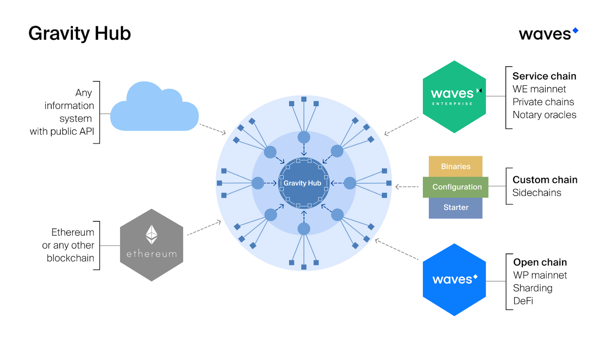

# Gravity Hub

В конце 2019 в Берлине Александр Иванов, основатель протокола Waves анонсировал создание Gravity Hub, нового продукта команды, которая призвана сразу несколько проблем.

Мы сейчас наблюдаем бурное развитие развитие многообразия блокчейн-протоколов, платформ и экспериментальных разработок, почти такой же бурный рост Интернета мы наблюдали 20 лет назад. Разнообразие технологий порождает прогресс, в то же самое время оно приводит к ослаблению принятия технологий массами (mass adoption). Разработчики продуктов и организации сейчас вынуждены выбирать конкретную технологию или протокол, на базе которого они будут строить свои приложения. В свою очередь, пользователи и аудитория других протоколов теряют доступ к таким приложениям. Все это делает экосистему в целом очень разобщенной и экономически неэффективной.

Каждая децентрализованная система с внутренней экономикой токена является замкнутой с точки зрения обмена информацией, как с другими сетями,  так и с внешним миром. Для передачи данных из внешнего мира в блокчейн сеть, а также коммуникации между различными блокчейн сетями необходимо доверять, так называемым, оракулам. Возникает парадокс необходимости доверия отдельным элементам в системах, предназначенных убрать элементы доверия. Поиск и разработка решений, создающих условия повышенной надежности и безопасности использования  блокчейн сетей с оракулами, а также коммуникации между сетями является ключевой задачей в индустрии на данный момент.

Наконец, эффективное решение задачи кросс-блокчейн коммуникации и оракулов данных открывает возможности для горизонтального масштабирования продуктов, которые построены над блокчейн протоколами, через механизм, так называемых, сайдчейнов.

На сегодняшний день уже существуют проекты, решающие описанные выше проблемы: Chainlink, CosmosHub, Polkadot и другие. Однако, большинство существующих решений обладают тремя общими недостатками:

- Ориентированы на развитие своего собственного, дополнительного блокчейна, вместо того, чтобы действительно быть блокчейн-агностик решением.
- Вносят в систему новый уровень сложности в виде токена, с особыми экономическими свойствами и плавающим, сильно волатильным курсом.
- Не являются в реальности комплексной блокчейн агностик системой оракулов, поддерживающей коммуникацию блокчейн сетей с внешним миром, кросс-блокчейн коммуникацию и переводы средвств, а также сайдчейны в рамках одной целостной структуры.

Gravity Hub призван решить обозначенные проблемы и представляет собой решение следующих задач, отсортированных в порядке приоритета:

- Блокчейн агностик децентрализованная кросс-блокчейн коммуникация: децентрализованные приложения в разных блокчейнах должны иметь возможность обмениваться данными или ценностями. Например владелец аккаунта на Waves должен иметь возможность работать с приложением Uniswap в сети Ethereum, без необходимости создания аккаунта в Ethereum и покупки токенов Eth. Или, любой владелец аккаунта в сети Ethereum будет иметь возможность пользования приложением Neutrino dApp и заниматься стейкингом без необходимости создания аккаунта в Waves и покупки Waves на биржах. Все это будет автоматически обеспечиваться системой Gravity Hub.
- Экономическая мотиваця агентов предоставлять данные из реального мира и других блокчейнов: Gravity Hub предоставляет провайдерам данных возможность монетизировать свои услуги, выражаемые в нативных токенах поддерживаемых Gravity Hub блокчейн платформ.
- Наличие возможности получать данные из реального мира и из других блокчейнов без необходимости доверия кому-либо открывает возможности для масштабирования сетей с использованием сайдчейнов.
- Предоставление разработчикам технического разнообрания, чтобы они могли выбирать наиболее подходящие инструменты: виртуальные машины или не Тьюринг-полные языки программирования; фиксированные или изменяющиеся комиссии; алгоритмы консенсуса (Proof of Work, Proof of Stake, Leased Proof Of Stake, BFT и т.д.).

> Проще говоря, Gravity Hub решает 2 проблемы:
> 1. проблему оракулов - через их децентрализацию (мы рассматривали проблемы в главе 7 на примере Oraculus)
> 2. проблему несовместимости протоколов блокчейнов - через возможность пересылать данные и средства из одного блокчейна в другой

**В отличие от других похожих платформ, Gravity Hub не использует свой токен, чем выгодно отличается от конкурентов.**

Схема работы GravityHub представлена на схеме ниже:

Разработка Gravity Hub сейчас находится в активной фазе, ведется исследовательская работа и идут обсуждения лучшей архитектуры решения, поэтому, если вам интересно принять участие, вы можете это сделать в Github Gravity Hub.
